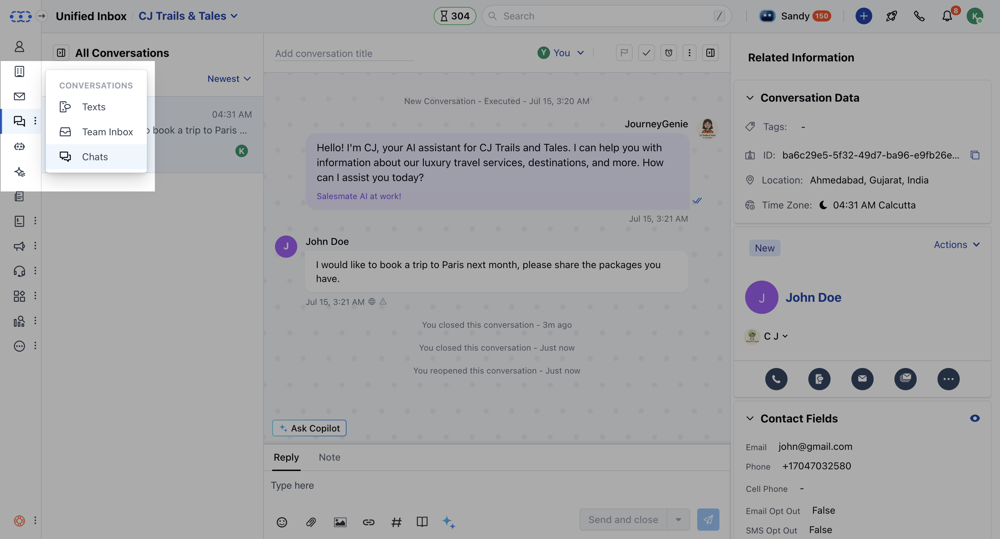
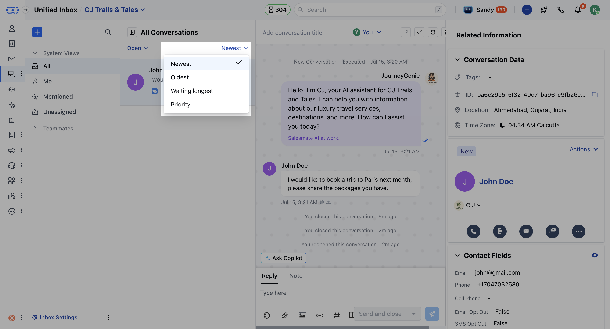
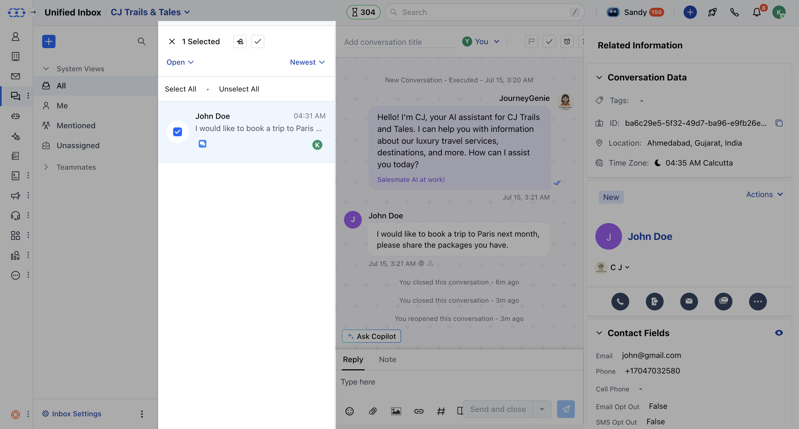

Bulk operations help you to quickly assign the conversations in your Chat to other users having the Chat license, and also allow you to close the conversations which are no longer required to be open.

### **For performing bulk operations, follow the steps below:**

- Navigate to the **Conversations Icon** on the left menu bar
- Click on **Chats**

* Select the conversation from the Inbox or apply **filters** to segregate the
conversations you want. [Learn more about using filters in this
article](https://support.salesmate.io/knowledge/articles/360059577212/en-us?brand_id=1467849).

*
Select multiple conversations by **hovering your cursor** over any conversation
and selecting the checkbox. * Once you select the conversations for **Bulk
operations,** you can: * **Change the ownership:** It will change the owner of
chosen conversations at once. * - **Close the conversation:** It closes all
chosen conversations at once.

<Note>

- **Note:** * You can only close a conversation if you have the
- [permission "Can close conversation".](https://support.salesmate.io/hc/en-us/articles/360058438992)
* You can only reassign a conversation if you have the
- [permission "Manage conversation ownership".](https://support.salesmate.io/hc/en-us/articles/360058438992)

</Note>
