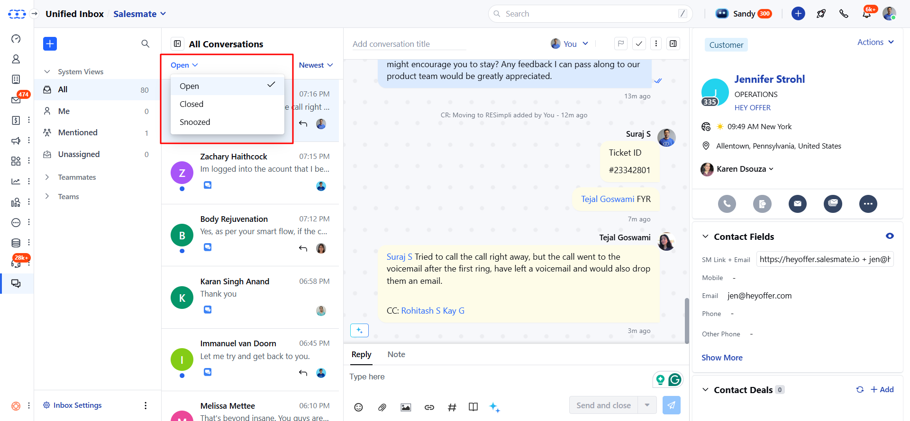

Salesmate Chats provides you quick filters to narrow down your search time.

You can access chats by following below steps:

- Navigate to **Conversations Icon** on the left menu bar
- Click on **Chats**

* Click
on **All Conversations**

Below are the quick filters which provides prompt data to view specific chats.

### All Views:

- **All**: It shows the entire list of conversations along with the the display count for total unread conversations by you.

- **Me:** It filters the list of conversations that are assigned to you. The figure besides it shows the count for the conversations that are assigned to you and are unread.

- **Mentioned** - It shows the list of conversations where you have been mentioned. The figure besides it shows the count for the conversations where you are mentioned and are unread.

- **Unassigned**- It shows the list of all unassigned conversations. The figure besides it shows the count for the conversations that are unassigned and unread by you.

Once the user views the chat, the count will decrease depending on the number of
chats viewed by him.

### Teammates:

You can also view the list of conversations assigned to your teammate by choosing any of the users from the teammate tab. The figure beside each teammate denotes the count of open and assigned conversations to him.

<Note>

**Note**:

- The users with Skara license will appear in the teammate tab.

</Note>

### Team:

You can filter the list of conversations assigned to a particular team by selecting a team from the Teams tab. The figure in the bracket shows the count of open and assigned conversations of that respective team.

<Note>

- *Note**: 

- If there are no teams created by you, the TEAM tab will not appear

</Note>

### Filtration on the basis of Status:

Chats can be filtered on the basis of its status as mentioned below:

- **Open:** Open chats are those conversations which are active and ongoing.

- **Closed:** These are the conversations that are already completed and closed by you.

- **Snoozed:** These are the conversations that are temporarily put on hold. 

You can also
[sort](https://support.salesmate.io/hc/en-us/articles/360058450272-Sort-the-conversations)
the conversations on the basis of Newest, Oldest, Waiting Longest and Priority
