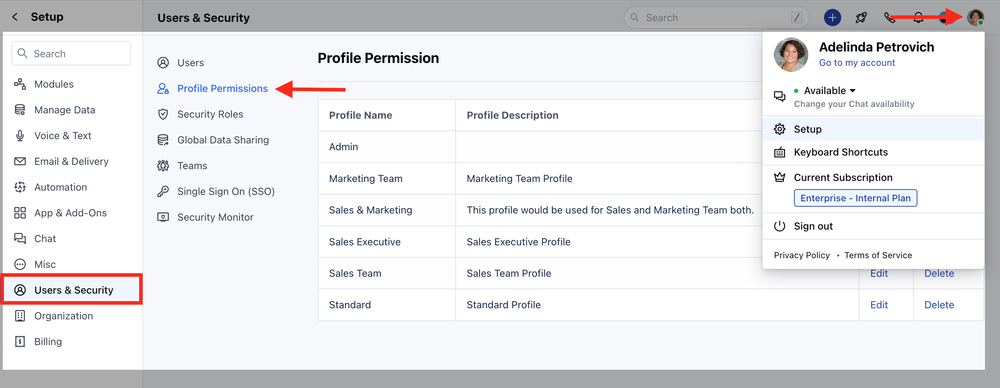
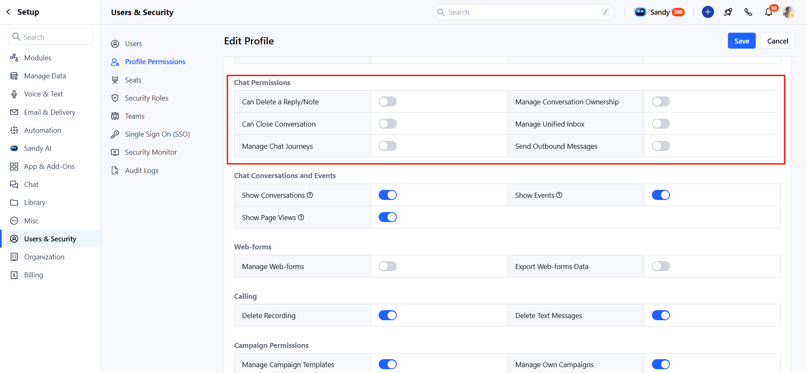

#### Roles are reusable sets of permissions that you can assign to users for your Salesmate Chat. They make it simple to update permissions for a large group of people all at once.

**To assign the rights of Chat to different profiles, follow below steps:**

*   Navigate to **Profile Icon** on top right corner
*   Click on **Setup**
*   Head over to **Users & Security**
*   Click on **Profile Permissions**

*   Edit the **Profile**, it could be Standard or any other custom profile
*   Now, on the **Chat Permissions** section, assign the rights accordingly.

Where,

*   **Manage conversation ownership -** Users with this right can change the ownership of the conversation. 
*   **Can delete a reply/note -** Users with this right will get options to delete the chat reply or note. 
*   **Can close a conversation -** Users with this right can close an open conversation. 
*   **Manage Chat settings -** Users with this right can access the messenger settings to change the appearance and other settings.
*   **Manage canned responses -** Users with this right can create, edit or delete canned responses and folders related to chat messages. Users without this right can only use those canned responses while responding back to customers.
*   **Send Outbound Messages -** Users with this right can initiate the conversation with contact from salesmate

