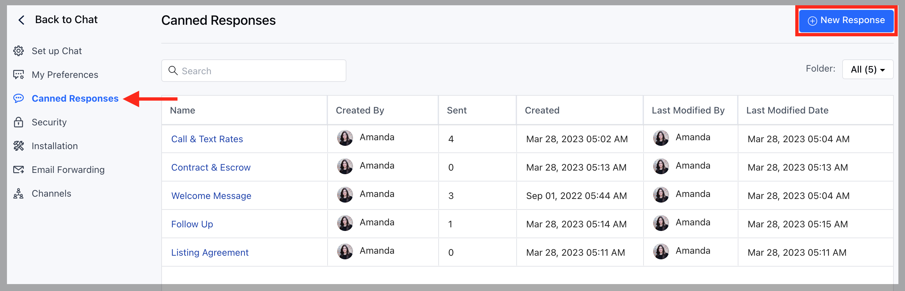
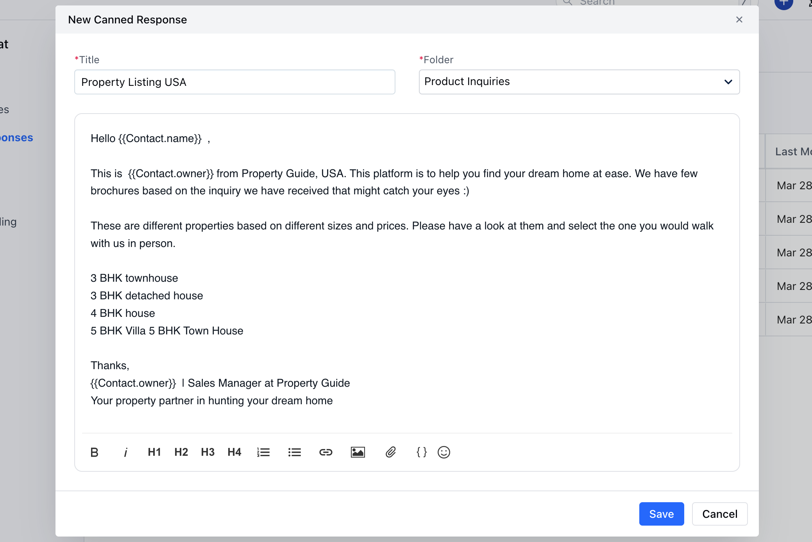
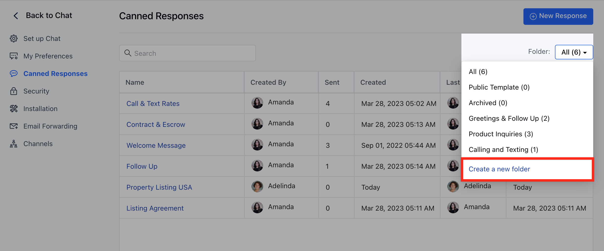
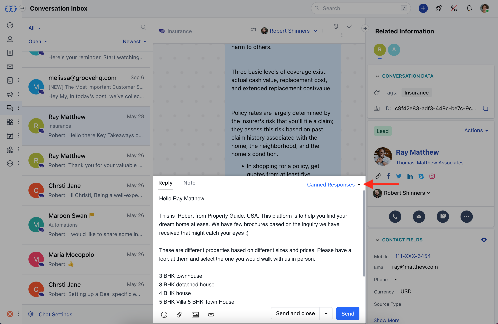
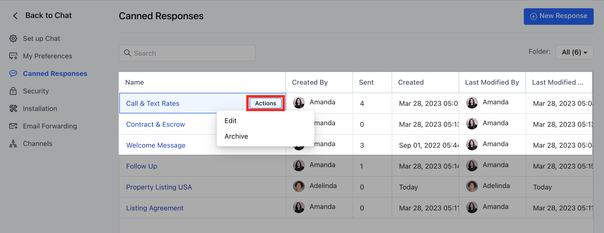

With this article you would be able to speed up your responses with customizable and swift repeatable actions, narrowing down on expected response time.

**Canned Responses** helps rep's to optimize swift replies with a single click, giving you the flexibility to tweak them for a personal experience.

###  **Topics covered:**

- [How to Create Canned Responses](#how-to-create-canned-responses)
- [Managing Canned Responses in Folders](#managing-canned-responses-in-folders)
- [Using Canned Responses in Chat](#using-canned-responses-in-chat)
- [Manage Canned Responses](#manage-canned-responses)

###  **How to Create Canned Responses** 
To create a Canned Response, please follow the below-mentioned steps:

- Navigate to **Conversations Icon** on the left menu bar
- Click on **Chats**
- Head to **Chat Settings** on bottom left

- Select **Canned Responses** in the settings menu 
- Click to **Create + New Response**

- Provide the **Title** and **Response Message**
- Choose the **Folder** if you want to categorize or group canned responses.

- Hit **Save**

<Note>
- While you provide a **Title** in the Canned Response, make sure it has proper reference as it will be the primary way your teammates will **search** for, **share** and use **Canned Responses**, so make it more clear and concise.
- You can apply **attributes** e.g. \{\{Contact.name\}\} to address your Customers and Leads, Salesmate offers Merge Fields for all available Custom Fields in the account.
- The content is not sent immediately when you apply the Canned Responses, so you’ll always have the opportunity to customize it further.
</Note>

###  **Managing Canned Responses in Folders**
- Canned Responses can be organized in different folders to avoid clutters and provide better visibility while selecting the required saved reply, reducing the search efforts.

Follow the below-mentioned steps to Create Folders:-
- Under Canned Responses, Select **Folder** Dropdown
- Click on "**Create a New Folder**"

**Using Canned Responses in chat** For effective and fast response paste one of the **Canned Responses** during the chat conversation, it will help your team save abundant time and typing constraints.

- Users can type the **\symbol** in the **Reply** field to quickly find the reply that fits the context.

- Alternatively, you can hit the corresponding **Canned Responses** label and search through all of your saved responses.

###  **Manage Canned Responses** 
Canned Responses can be **Edited** or**Archived** as and when needed by following the below steps :

- Go to **Chats**
- Click on **Chat settings**-**Canned Responses**
- Hover over **Actions** Menu against the Canned Response
- Hit **Edit** or **Archive** as Required

<Note>

**Note:** You can only create and manage Canned Responses if you have the
 [permission to "Manage Canned
 Responses"](https://support.salesmate.io/hc/en-us/articles/360058438992)
 otherwise you can only use canned responses.

</Note>
