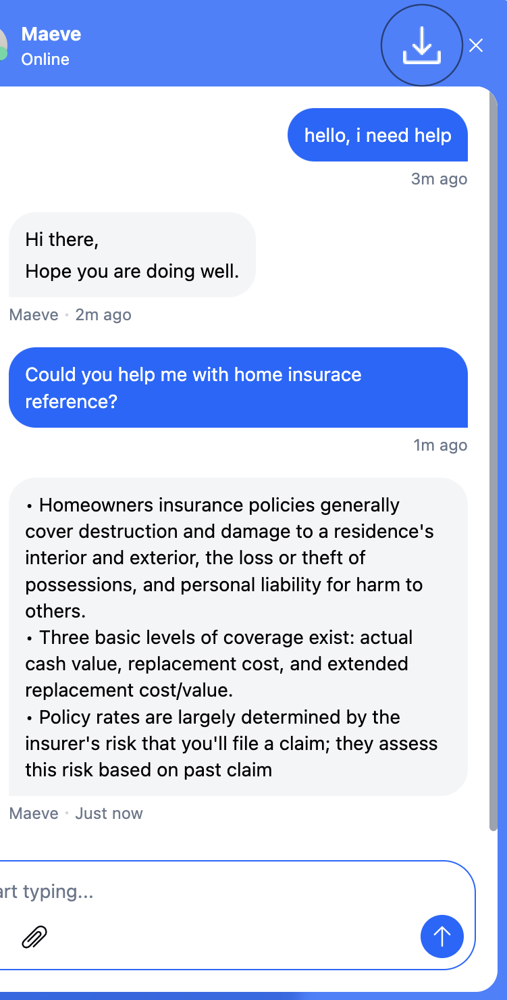
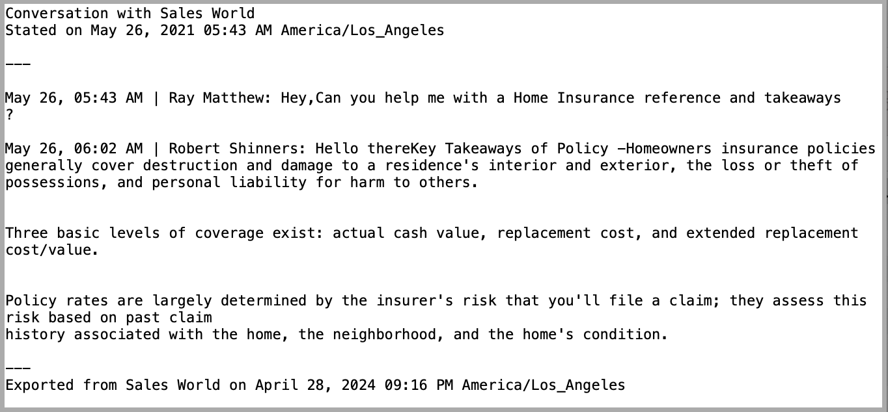

The chat transcript is a copy of your conversation, which can be downloaded directly from the Chat widget or you can ask the agent to send it to you.

### How visitors and customers can download transcripts?

Visitors/Customers can download the chat transcript from the web Chat. They can move to the header of the Chat and find the download icon. Clicking on the download icon will export the chat transcript in Text format.

  
To download the chat transcript, follow the below steps:

*   Open **Chat** widget loaded on the website
*   Open the conversation for which you want to download the transcript
*   Click the download button displayed at the top right on the header of the Chat widget

The transcript will be downloaded as a text file.

#### **Chat transcript contains the following information:**

*   Date and time with timezone
*   Conversation start date and time
*   All replies in the conversation with respective timestamps
*   Name of participants that is customer and agents involved in the conversation
*   Name of files, attachments shared in the conversation
*   Date and time of transcript export

<Note>
**Note  :**

*   Visitor or Contact can only download the transcript in text format from the Messenger widget.
*   The timezone configured in the **Chat >> Availability settings** is the timezone of the workspace
*   The transcript will only mention the file names of Images / Attachments or GIFs.

</Note>