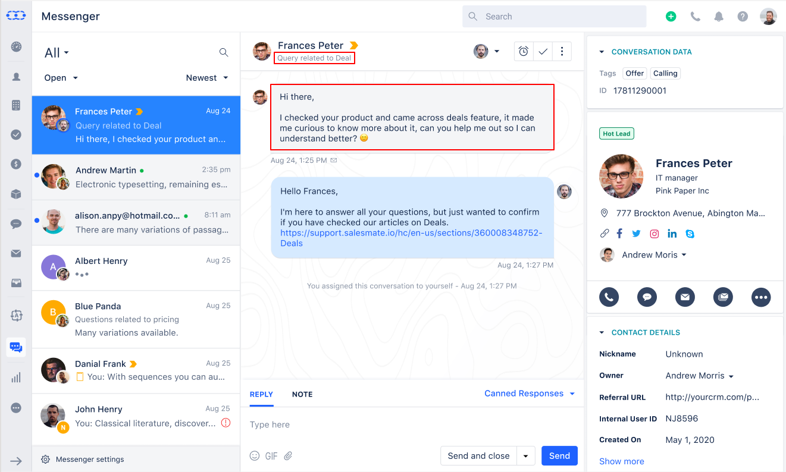
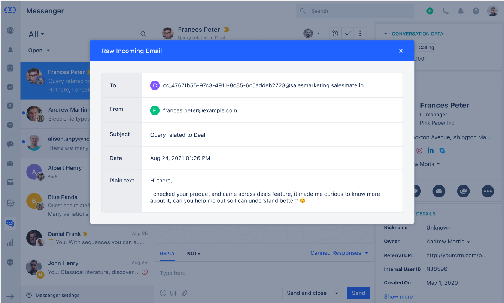
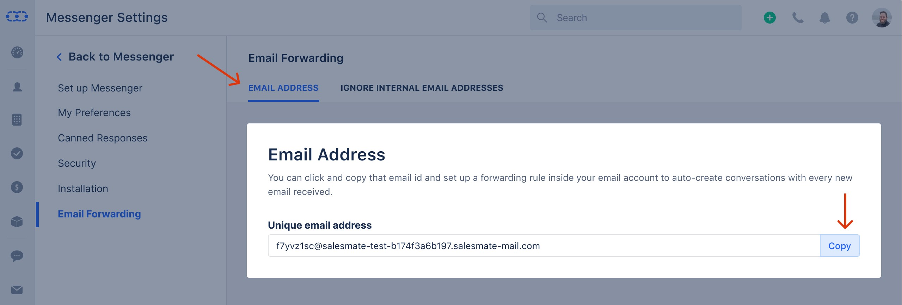

### Resolve customer’s queries by using Chat as a traditional ticketing system.

When you have a company's email address for the customers to reach you via email, then you can forward all those emails to your Chat and the support agents can get back to your customers by resolving all those queries simply via Chat.

### How does it work?

- First, you need to enable email forwarding on your email provider - Gmail, Outlook, or any other.
 Then each email that comes to your inbox is converted to a conversation inside Chat Inbox. The subject of an email query will be set as the conversation title so the agents can understand the priority of the conversation/query.
- For example, Customer sends you an email regarding "Query related to Deal" then, its forwarded to the Chat inbox, and the title of the conversation will be 'Query related to Deal' & the body content of the email will become the message.

* In case, you want to view the email that was sent by the customer then you can
click on the mail icon below the message to view the raw email.

#

### Why use Email Forwarding?

- It is very convenient for you as it enables you to solve all the queries from one platform - Chats. Now you don't need your agents to keep a check on email support, as you can utilize those resources on Chat for resolving all problems from one place!
- It makes things easier for your customers too by resolving their queries quickly and providing them a solution in the form of a conversation, so they can always check what their inquiry was and the resolution given to them, as it's much understandable when you have a chat transcript.

### How to start with Email Forwarding?

To set up Email Forwarding, simply follow the steps:

- Go to **Chats** from the left menu panel
- Click on **Chat Settings** available on the footer of the chat listing column
- Select the **Email Forwarding** option in the left sidebar
- Copy the email
- Now open your email provider's settings and follow the steps to set an Email Forwarding Rule for:

- [Gmail](#resolve-customers-queries-by-using-chat-as-a-traditional-ticketing-system)

- [Outlook](https://support.office.com/en-ie/article/forward-email-from-office-365-to-another-email-account-1ed4ee1e-74f8-4f53-a174-86b748ff6a0e)

Now conversations will be created automatically in Chat Inbox, for every email you receive in your email provider's inbox.

### What happens to CC and BCC recipients?

As per our new feature i.e. [group conversations](https://support.salesmate.io/hc/en-us/articles/360058450192), the recipients added in CC are added to the conversation as participants. And the recipients added in BCC are dropped.

- **Notes:**

* If you have disabled the attachments then any attachments associated with the email will be dropped.
* Any email addresses included in To or CC that are part of ignore list will be dropped, for more info refer to
[Ignore internal email addresses](#resolve-customers-queries-by-using-chat-as-a-traditional-ticketing-system)
