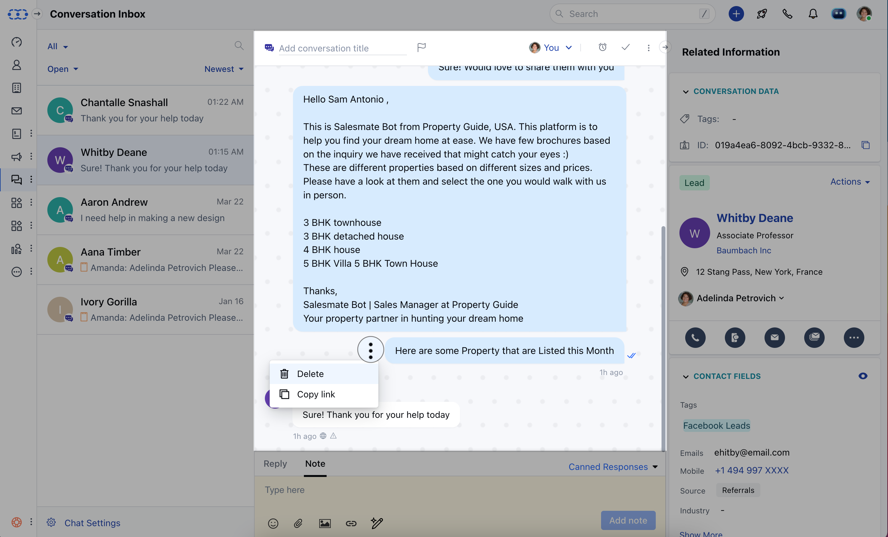
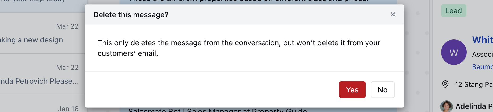

In Salesmate Chat, you can delete a reply or note which you've posted inside the conversation, but you should have the [permission "Can delete a reply/note"](https://support.salesmate.io/hc/en-us/articles/360058438992) first.

Follow these simple steps to delete a reply or note:

- Hover the mouse over the reply or note which you want to delete
- Click on the **three-dotted** action button.

- Click on **Delete**

- Click on **Yes** to confirm.
- Your reply or note will be successfully **deleted**.

<Note>
  **Note:** This will permanently delete the reply or note from the conversation
  but won't delete it from your teammate's email if already notified.
</Note>
