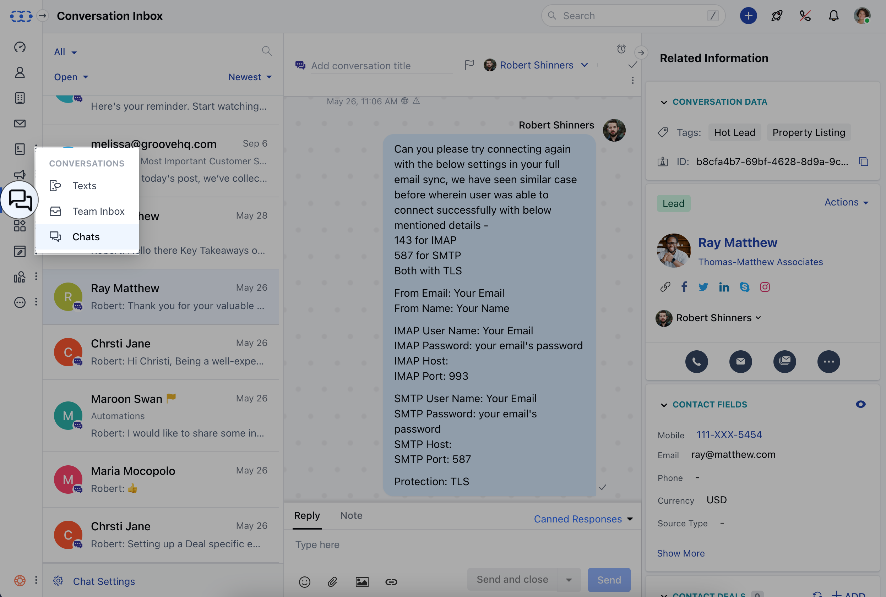
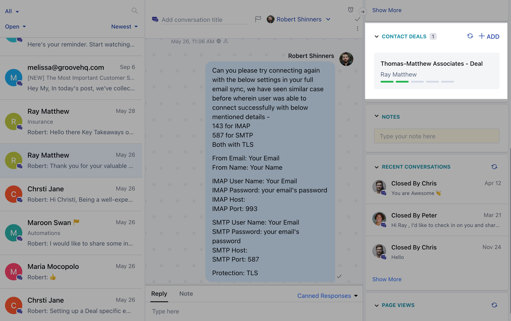

#### With the Chat feature, you can now convert opportunities from Conversations using "Add Deal".

*   Navigate to **Conversations Icon** on the left menu bar
*   Click on **Chats**

*   Under the Chat Conversation view "Check the Right Block for "**Contact Deal**"
*   Users will get an option to create a deal using the "**+**" **Add Deal** Icon
*   On the creation of a deal from the conversation panel, the deal gets auto-linked with the conversation.
*   Multiple Deals can be associated with a Contact at a time.

