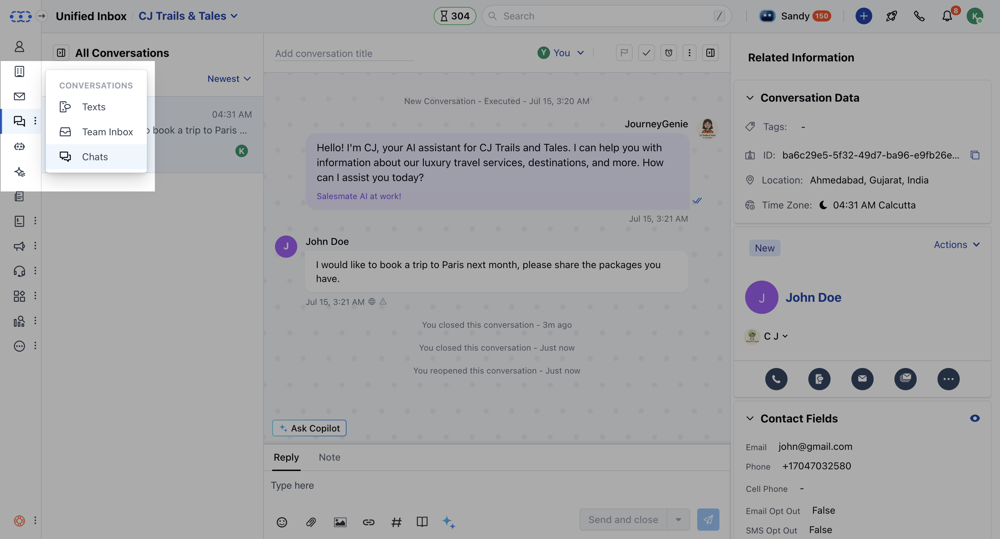
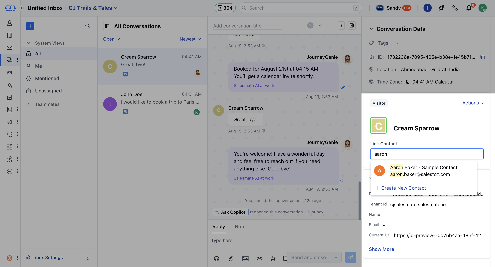
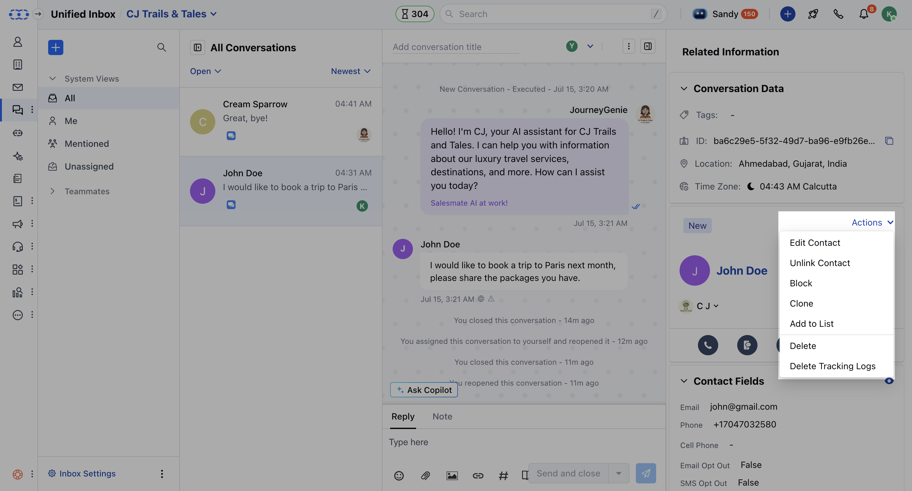
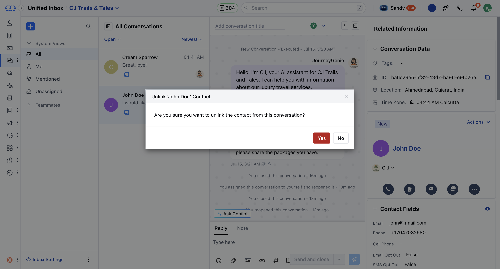

With the Unified inbox feature, you can now automatically associate a contact whenever a visitor initiates a chat. Similarly, you can also disassociate a contact from a conversation when necessary

**Topics covered:**

- [How to Link a Contact](#how-to-link-a-contact) 
- [How to Unlink a Contact](#how-to-unlink-a-contact)

### How to Link a Contact

- Navigate to the **Conversation** Icon on the left menu bar
- Click on the **Unified inbox** option 

- Select the Chat that you wish to link the Contact for and click on Link Contact 
- You can either select a Contact to Link with the Conversation or simply create a New Contact

### How to Unlink a Contact

- Navigate to the **Conversation** Icon on the left menu bar
- Click on the **Unified inbox ** option 

- Select the **Chat** that you wish to **unlink the Contact** 
- Go to the **Contacts Widget** on the right and click on the **Actions** button 
- Select **Unlink Contact** from the dropdown

- Confirm the Action to continue to disassociate the Contact from the conversation

