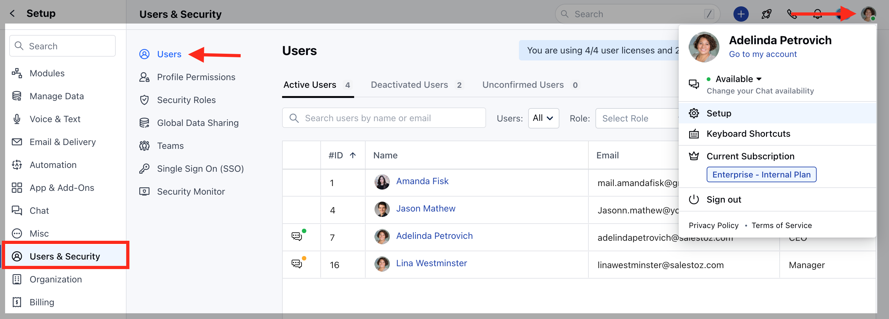
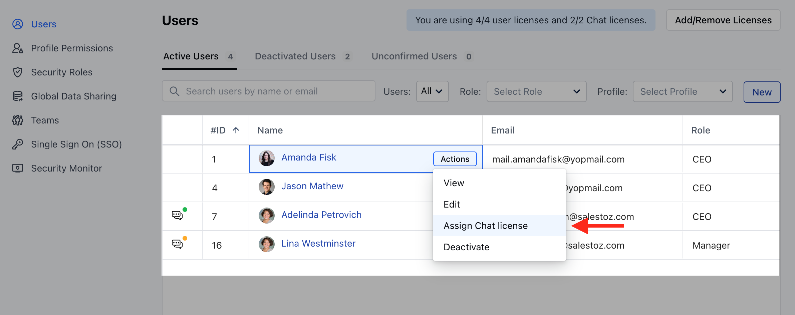
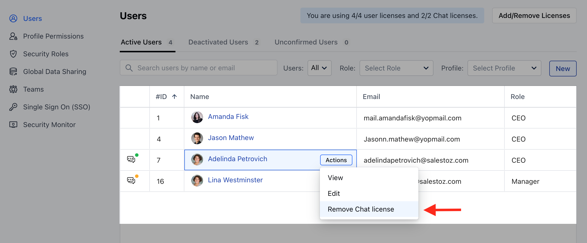

Sometimes you don't want your entire team to have access to everything in Skara. It's easy to give certain users of your team access to certain data and features in Skara. Similarly, you can manage the Unified Inbox (Skara) licenses in Skara and can manage who should have the Unified Inbox license and who shouldn't.

### **To assign a Unified Inbox license to users, please follow these steps:**

- Navigate to the **Profile icon** in the top right
- Click on the **Setup**
- Head over to the **Users & Security** 
- Click on **Users**

- You will be able to see the list of all users.
- Click on the **Actions** button and choose "**Change Seat**".
- If you are on the Messenger trial, then the Unified Inbox license will be auto-assigned.
- But If you are on the paid plan, then the system will check for two cases.
- **Available License** - If there is any available unused purchased license then it is assigned to the user.
- **No License**- If no license is available then the user will be asked to purchase a new license and assign it. The system will auto charge your credit card and add a license to your system.

Refer to the below images: 

### **To remove Unified Inbox license from users, please follow these steps:**

- Same steps as above to see the list of all users.
- Apply filter "**Users with Unified Inbox license**"
- Find the user
- Click on the **Action** button and choose "**Remove Unified Inbox License**"
- The license will successfully be removed.
- Refer to the below image:

