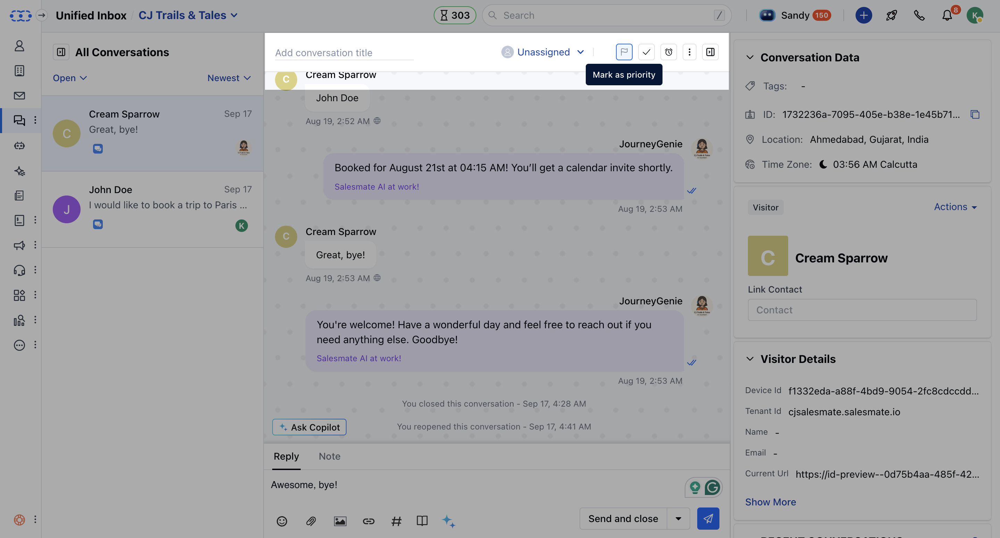

Prioritize your conversations so that your team can focus and close them faster.

**How Does Prioritizing help you?**

- Focus on the conversations that matter the most.
- Share crucial conversations with your teammates while you are working around the clock.
- [Sort out](https://support.salesmate.io/hc/en-us/articles/360058450272) the most important conversations very easily.

**How can you prioritize your conversations manually?**

- To prioritize conversation manually, you can click the **Flag icon** available at the top right corner of the conversation panel.

