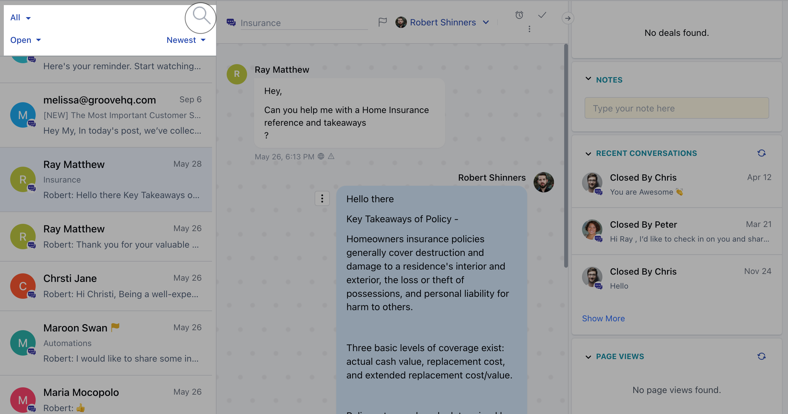
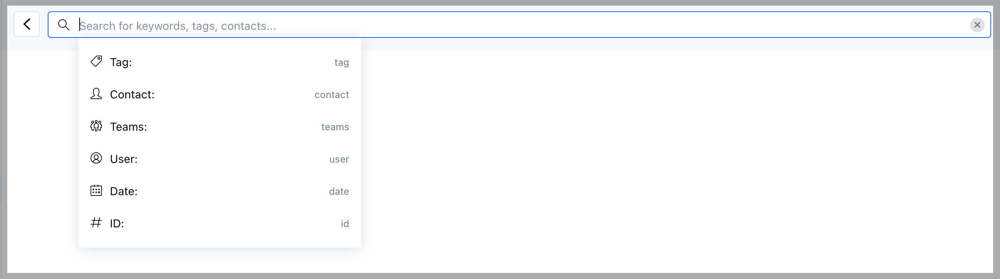
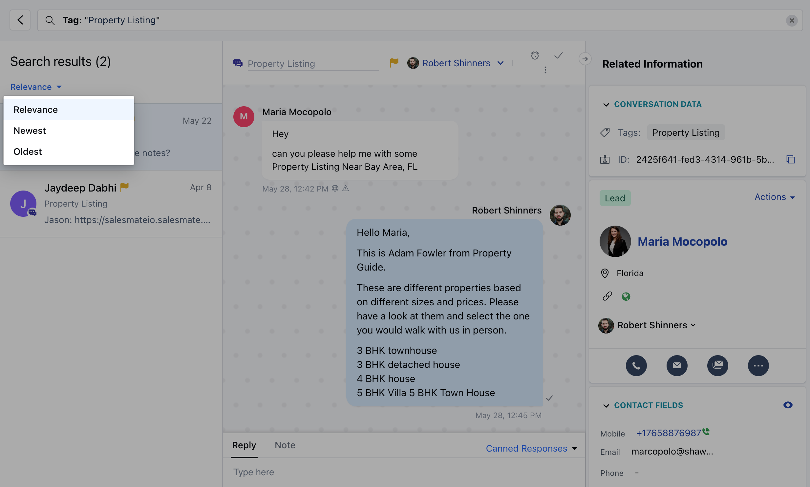
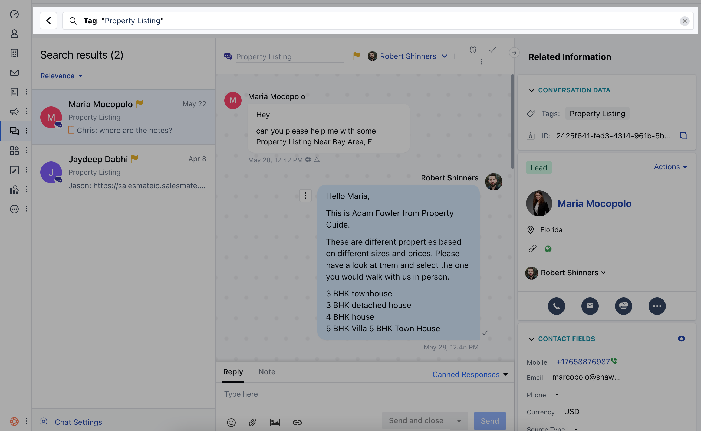
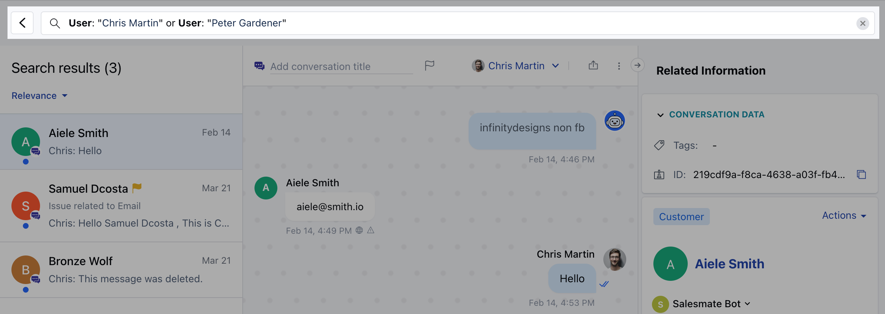
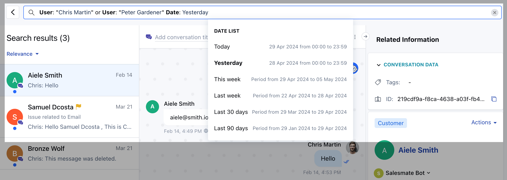

You might often need to **search** or **filter** your past conversations to refer to the conversation history with a contact, reference, or get context on older discussions.

In Chat Inbox, you can search by one or more keywords and filter your conversations. The search keyword is matched inside notes and replies as well. 

# Searching for keywords in conversations

- To **search** your conversations, click the **search icon** on the top left: 

* Then, start typing your keywords and you’ll see the option to search for the
"_keyword"_. Click it or hit enter to search:

- **Use quotation marks to search by keywords or phrases, you can also use
quotation marks to search for more than one word. For example:**

- If you search for `"Property Listing"` (with quotes) you’ll find conversations containing that exact phrase.

- If you search for `Property Listing`, (without quotes) you’ll see conversations that contain the words "Property" and "Listing", both together and separately.

<Note>

**Note:** Keyword searches are not case sensitive. For example, “property
 listing”, “Property Listing” or "PROPERTY LISTING" will return the same
 results.

</Note>

Your search results will appear in the order of most **relevant** conversations first. To view the **oldest**, or **newest** conversations first, use the dropdown on the left: 

# Filtering conversations

You can filter out conversations using the following options:

- **Tag** - View conversations with a specific tag.

- **Contact** - Search conversations associated with a particular contact.

- **Teams** \- Show conversations assigned to a specific team

- **User** \- View conversations assigned to a user.

- **Date** - View conversations for a specific date, today, yesterday, last week, the last 30 days, or the last 90 days.

# Using filters in your searches

- To narrow down your search to find something more specific, like mentions of a topic within a certain date range, or all conversations with a specific tag, you can add filters to your search. For example, if you’re trying to gauge interest in a new messenger feature, you could search for all conversations with the keyword “Messenger” that also have the tag “FR: Messenger”.
- You can also search without any keywords, using only filters to find relevant conversations.
 E.g.: “- **Tag:** Churn Feedback,

* **Date:** Last week”.* To add filters to your search, type any keywords you’d like to include, then select one of the filters in the dropdown, like "Tag":

<Note>

**Note:** You can also add keywords after choosing your filters.

</Note>

- Next, start typing the name of the tag you’d like to filter by, and select the right one:
- This will return all conversations containing that keyword, with that tag applied. 
- If you want to further refine your search, you can add more filters in the same way as above, or by typing the name of the filter followed by a colon, like “User:”. This is case sensitive.
- Then, select the value you’d like to filter by, and press ‘Enter’ to search.

You can also search using **OR** and **AND** conditions, but you’ll need to use
parenthesis. For Example:

- If you want to search for conversations assigned to users like **Adam Fowler** or **Chris Martin** then your query would be:**User:** **Chris Martin"** **or User: "Peter Gardener"** 

* If you want to search for the same in a particular date range then the query
would be: - **Date:** Yesterday and (**User: Chris Martin"** or**
User:"Peter Gardener"** )

* To clear the search or filter hit backspace to remove it or if you wish to
completely remove the search criteria hit x towards the end of the search area
