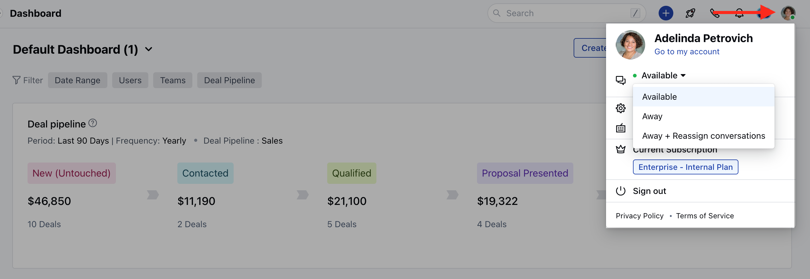
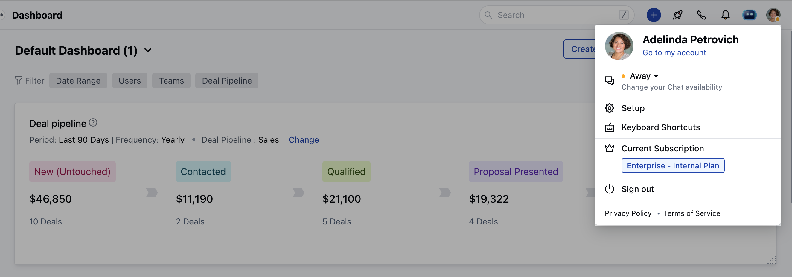
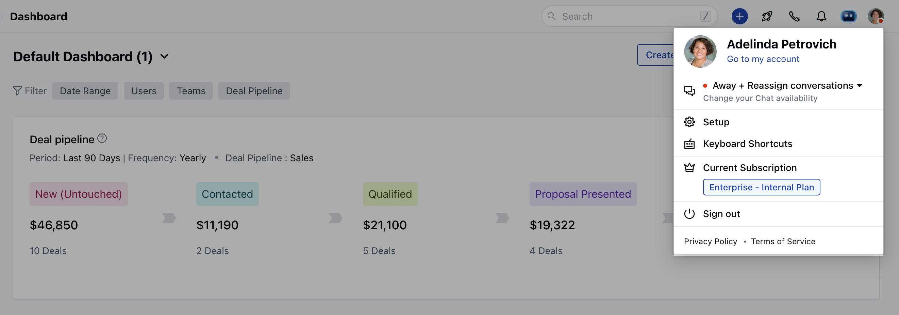
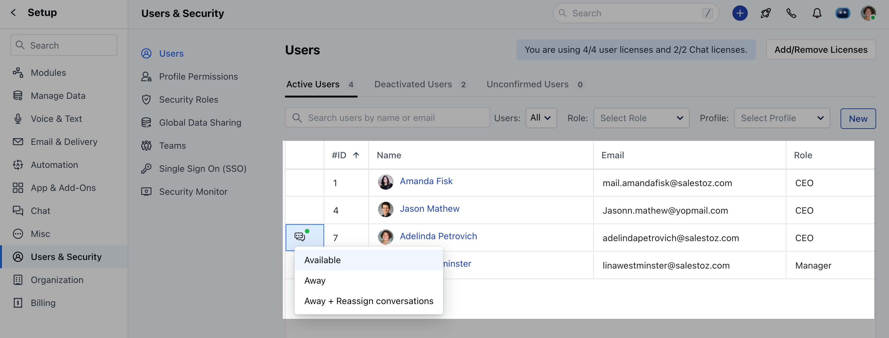

Away mode helps you to automatically reassign the conversations to others when you are not available to chat.

- **Topics covered:**

*
[How to Enable Away mode](#how-to-enable-away-mode)
*
[How to set Away mode for other users](#how-to-set-away-mode-for-other-users)
*
[Difference between Away mode and Away Status](https://support.salesmate.io/hc/en-us/articles/360058439252#h_01HWSAA5H3J45M46B6ZWYS2D2K)

### How to Enable Away mode

- Navigate to **Profile icon** on top right corner.
- Click on the **Available** dropdown menu with the Chat icon

*
To set away status click on **Away,** this will put your status as away on the
Chat widget which appears to your customers.

* To enable away mode, you can also select **Away+Reassign conversations** from
the dropdown menu if you want the conversation should be assigned to someone
else when you are away and they respond inside your conversation.

### How to set Away mode for other users

If you have an admin profile then you can change the availability status for other users by following these simple steps:

- Navigate to the **Profile Icon** on top right corner.
- Click on **Set Up.

- Head over to "**Users & Security**"
- Click on **Users.

- You will be able to see the list of all users.
- Click on the Chat icon on the left side of the user name
- Select any of the below modes

- **Available**
- **Away**
- **Away + Reassign Conversations**

* Away status is shown for the users who are inactive for the last 5 minutes and
don't have any Salesmate tab open inside their browser. Other users or visitors
will be able to see the status, but none of the conversations are reassigned to
others.

<Note>

- **Note:** If you set your availability as **Away or Away and Reassign Conversations**, you will not get any sound notification for the new messages.

</Note>
