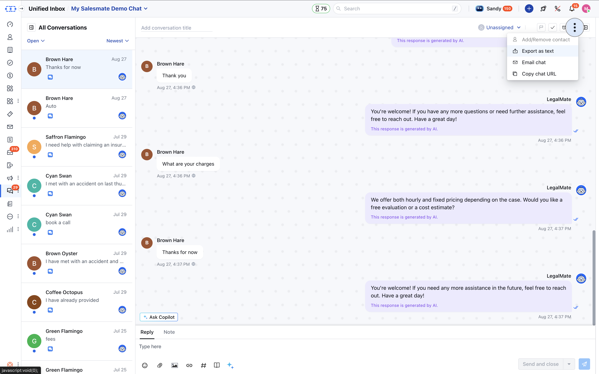
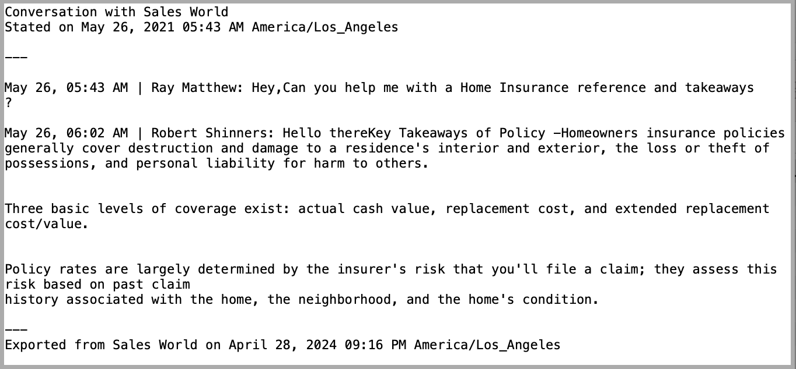
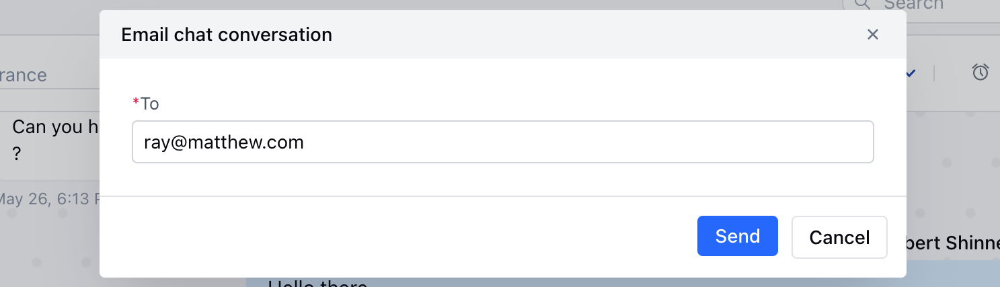

The conversation we do on chats usually tends to miss when you need it the most, but with the feature to download /email transcript you can easily download the important conversation and have it stored with you for future reference.

### How Skara users can download or Email transcripts?

- Send chat transcripts to your customers as a text file or directly via email.
- Skara messenger allows you to download or email a copy of the conversation history - chat transcript, and share it with your customers.
- Customers and Visitors can also download the transcript via Unified inbox or request it at any time during a chat session.

- **To download the transcript, please follow the below steps:**

- Go to Unified inbox and open the required conversation
- Click on the **More Icon** shown as three dots at the top of the conversation panel
- Click on the **Download Chat** option
- Choose **Export as text** option
- Chat transcript will download in the form of a **text** file
- User's can further share the text file as an **attachment** to an email.

- **Sample Format of Text Transcript:**

- _To email the transcript, please follow these steps:_\*
- Go to **Unified inbox** and open the required conversation
- Click on the "**Action**" button shown as three dots at the top of the conversation panel
- Click on the **Email Chat** option
- A popup will appear
- Filled with the primary contact's email address, but you can change it
- Review the email provided in the **To** field, change if required
- Hit **Send**
- The chat transcript will be sent to the email address as mentioned below

### **Chat transcript contains the following information:**

- Date and time with timezone
- Conversation start date and time
- All replies in the conversation with respective timestamps
- Name of participants that is customer and agents involved in the conversation
- Name of files, attachments shared in the conversation
- Date and time of transcript export

<Note>
  **Note:** By default, the email transcript is sent from [noreply@salesmatemail.com,](#how-salesmate-users-can-download-or-email-transcripts) but If the user wants to send the email from his domain, then [Salesmate also allows
  that by enabling
  DKIM](https://support.salesmate.io/hc/en-us/articles/360006983771), and then the transcript will be sent from the user's email address instead of [noreply@salesmatemail.com.](#how-salesmate-users-can-download-or-email-transcripts)
</Note>