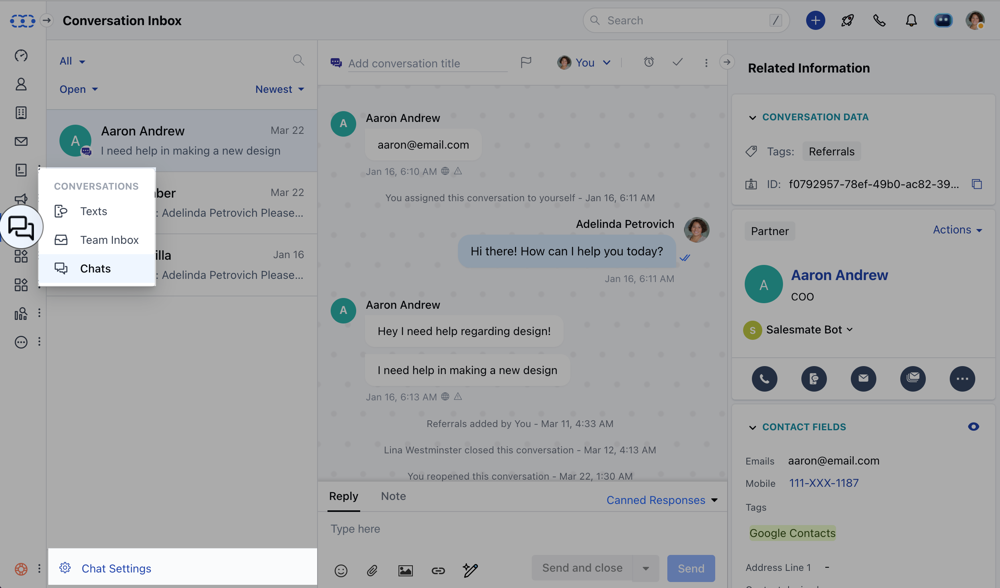
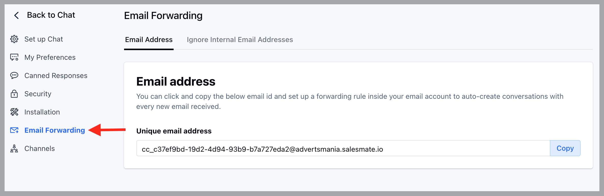

- You can use Skara Unified inbox to support the traditional ticketing system too. You can forward your support queries to Chats default email address and it will auto-create the conversations inside. The users can reply to those conversations and the customer will receive those replies via email in the form of a chat conversation.

### Where to find the Chat inbox email address?

- Navigate to **Conversations Icon** on the left menu bar
- Click on **Chats**
- Head to **Chat Settings** on bottom left\*\*.\*\*

- Click on the **Email Forwarding** option in the left sidebar,
- You can click to copy that email address and set up a forwarding rule inside your email account to auto-create conversations for every email you receive on your email account.

<Note>
  **Notes:**

  - The subject of the email becomes the conversation's title when a conversation is created.
  - The body of the email becomes the conversation message.
  - If you have disabled the attachments then any attachments associated with the email will be dropped.
  - Avoid company's email addresses getting added to a conversation by adding them to [ignore list](https://support.salesmate.io/hc/en-us/articles/4407250022029).
</Note>