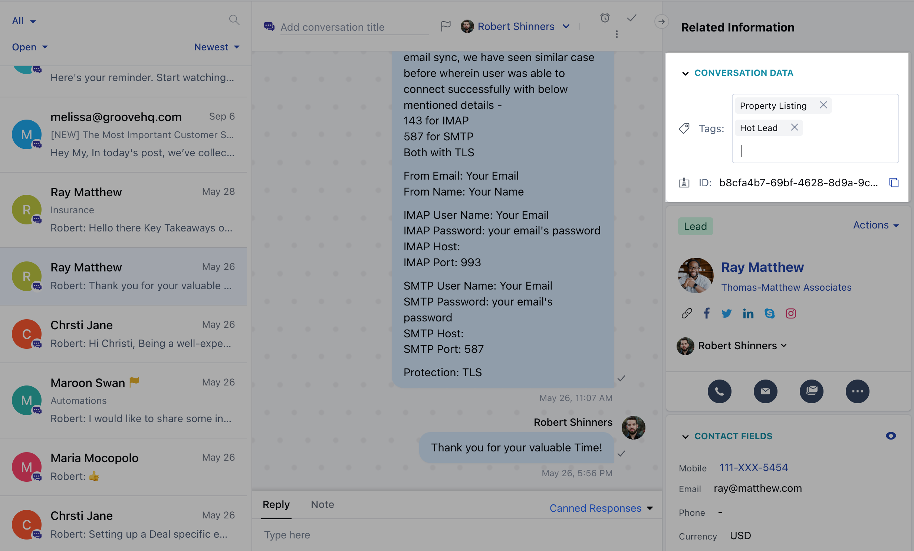

- **Tagging a conversation** can help you track, review, classify and group the conversations.
- The capability to tag the chats will keep conversations organized and easily identifiable. The fair leverage is in knowing the topics which are predominantly raised by your clients and acting on that feedback.
- Teams handing Unified inbox conversations can get different messages over the chat, e.g., general support, sales queries, issues or bugs, feedback, or client requests. Tagging conversations makes it easier for them to gauge what the customers are talking about - and it will all be easily searchable later.
- Engineering gets insights about the impact of bugs, product team about where the customers are getting confused and needs improvement. Thus, by tagging messages and sharing your findings, you can make sure correct feedback is shared with the right people across the company board.

# How to tag a conversation?

- Go to **Unfied Inbox**
- **Select** any conversation
- Now **click** on the tag's value inside the Conversation Data widget
- **Start typing** the name of a tag and suggestions of the existing tags will be visible, you can select any option from them, or you can create a new tag by entering the name of the tag and press enter.

# What to tag?

### **Positive Feedback**

- Everyone likes appreciations, and with such tags, you can maintain the conversations whereas customers have appreciated your product or services. It gives the product and design team a direction on working towards the most liked UI/UX features that the customers like and increases the customer life cycle. 

### **Feature Requests**

- What you offer is always not enough. Customers will want your product to do more than it currently does. This feedback helps you know what the customers want and why, and what is the market trend. Such tags can help your product team to align the product roadmap with the requests.

### **Churn Reasons**

- Some common reasons for churn are bad customer support, lousy onboarding, poor product-market fit, bugs, engagement, or unfit pricing. Capturing proper churn reasons can help you to improvise your products and services in the coming days.

### **Bug Reports**

- Bugs and product development go hand in hand. Even the best teams ship products with bugs. Whenever the users report a bug, you need to relay it to the correct people on the engineering team to have it fixed and share updates as they are being resolved. Tagging them as a 'bug' helps you identify which module needs to be prioritized for cleanups.