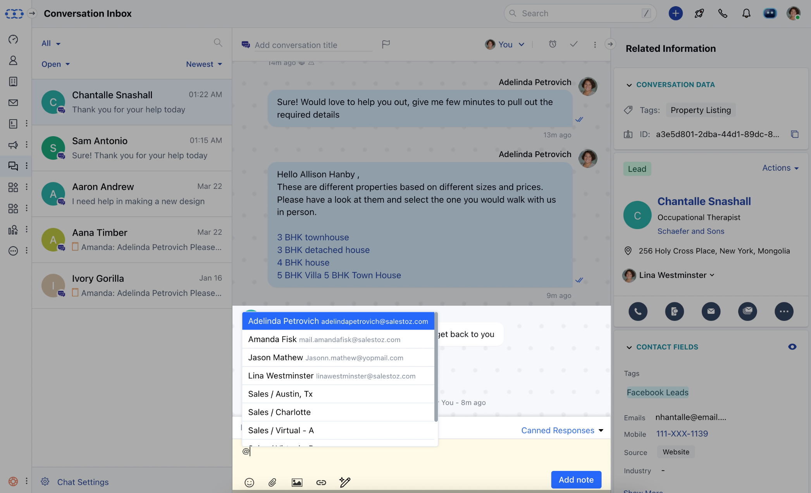

#### Notes are used for the internal purpose to discuss cases with your teammates. You can use mentions inside notes to raise a question, send a reminder, or make your teammates aware of the last point of discussion.

### Mentioning a teammate or user inside a note

- Just type "**@**" to see the list of users and teams, and then you can choose them accordingly. The mentioned users and members of mentioned teams will receive a push or email notification alert based on their preferences.
- In Salesmate Chats, you can add a note to a conversation.

