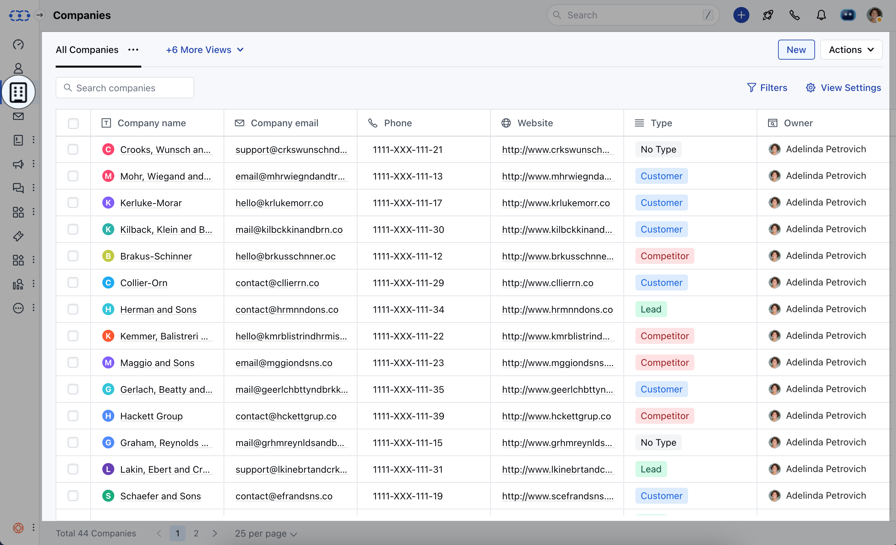

With Associated Conversations Widget easily view and manage all recent interactions with contacts within the same Organization.

To access the Associated Conversation Widget,

- Navigate to the **Company Module** from the left sidebar accessing to **Listing View**

*
Select the **Organization** and open it in the **Detail View** * Here you can
find all recent conversations linked to contacts within the same company, using
the **Associated Conversation** Widget. [Learn More about how to add Widgets to
Layout](https://support.salesmate.io/hc/en-us/articles/23726589057177-Customize-the-Page-Layout-in-Salesmate).

