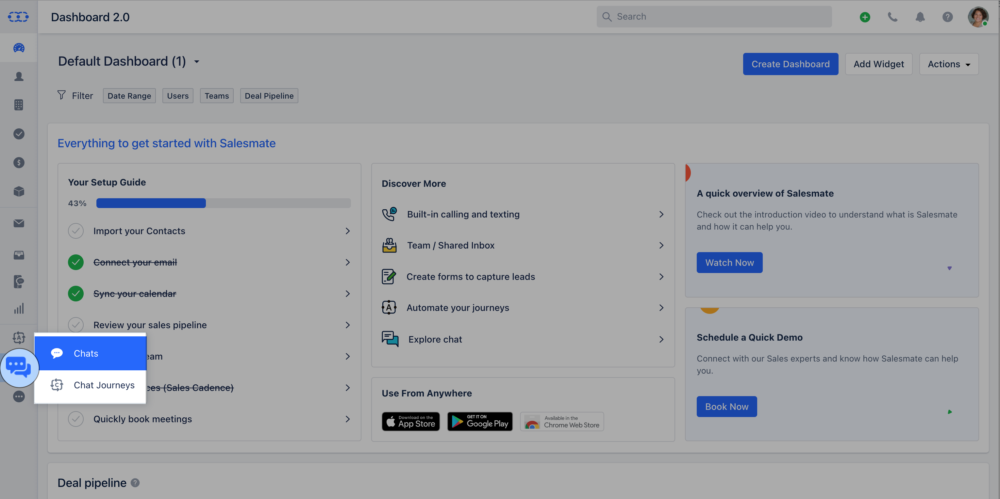

You might often need to **search** your past conversations to refer to the conversation history with a contact, reference, or get context on older discussions. Also, Track which pages your Lead or Contact has visited before starting the conversation.

With our new "Recent Conversations and Page Views" widgets on **Chat Inbox** and on the **Contact detail view** page, you can see the latest conversations and page views to understand or track any recent interactions.

**Recent Conversations and Page Views on Chat Inbox:**

Here, whenever you receive a chat from a Lead or Contact, you get an option to check if any previous conversation has been made or not, this helps you to identify the history of the Lead or Contact's requirement or query. Track pages visited by Lead or Contact.

- Navigate to Chats on left menu bar.

* Click on **Chat Setting** at the bottom left.

* Open a **conversation**, 
* On Quick bar, search for these widgets

* Click on any conversation and it will open that conversation.

**Recent Conversations and Pageviews on Contact detail view:**

On the contact detail view page, you could see the Recent conversation and Page views widget on the right-hand side of the screen, from here you could open any conversations or pages visited related to that contact.

- Go to the **Contact module**, 
- Open a contact by clicking on the name

* Here, on Quick Bar search for **these widgets** 
* Click on any conversation available under "**Recent Conversations**" and it will open that conversation
for a quick view 
* You can quickly track the page visits from the "**Page View**" option used by your customers to reach you over

