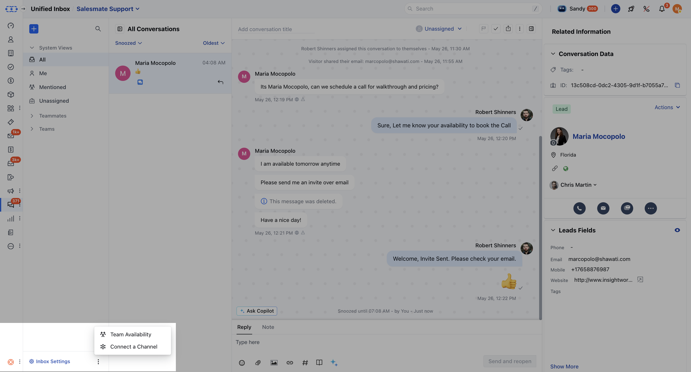
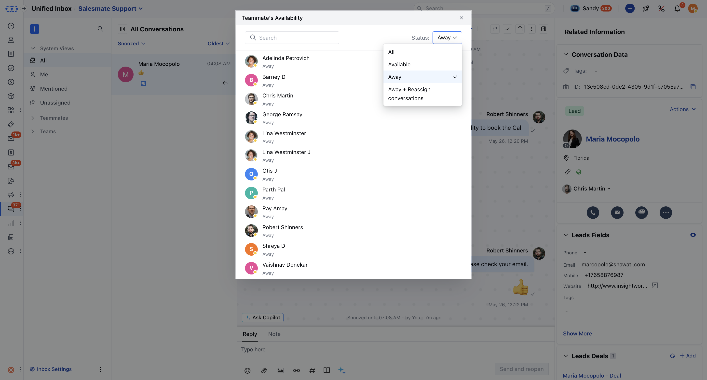

You can quickly see when your colleagues are available or out, making it easier to plan your workday. This new feature helps you manage your time more effectively, coordinate with your team, and ensure there’s always someone ready to assist your customers. With improved visibility into your team's availability, scheduling, and breaks become more efficient.

Please follow the steps below to check the Team Availability of team members:

- Click on the **More** option next to Inbox Settings
- Click on **Team Availability**

- You can search for users and filter them based on their status.

