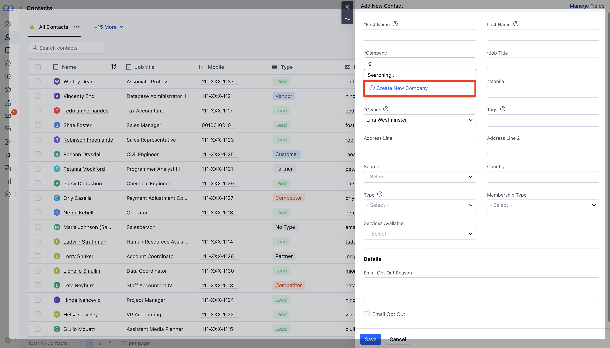
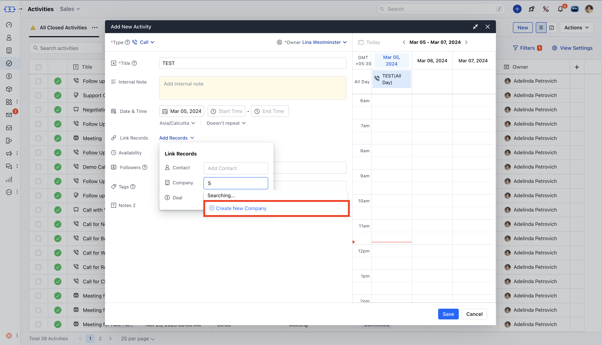
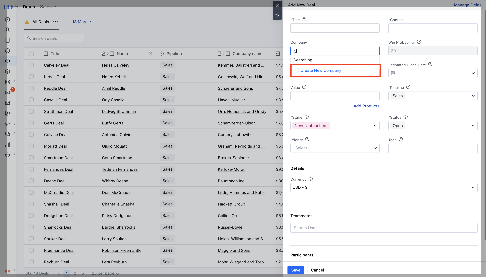
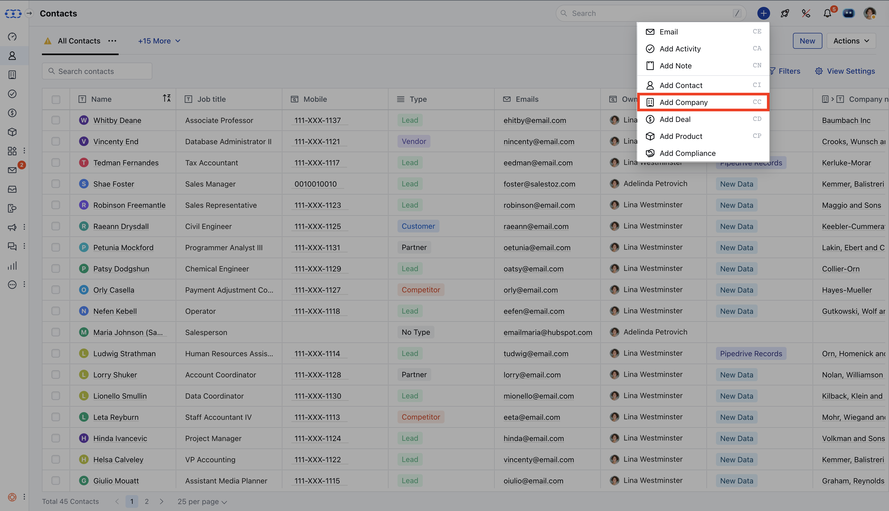

- **Companies** are nothing more than **commercial entities connected to the contacts** a salesman works with. Any Company's information page will include all Contact associated with that company as well as any notes, activities, or actions associated with any Contact or Deal associated with that company.

* Multiple contacts can be associated with a company.

* **Companies can also be associated with** Activities and

* **Deals**.

* Organizations are profiles holding long-term information, e.g., company websites and addresses.

<Note>

- *Tip:** If you need additional fields to document e.g., job titles and mailing addresses, Click [Here](https://support.salesmate.io/hc/en-us/articles/115000147025-Custom-fields-layouts-and-field-customisation) to learn how to create custom fields.

</Note>

**Companies can be added to the system through various methods:** Company >**Add Company**( Company Listing Page )

- **Contact >** Edit

- **Activity >** Company > Create New Company (Quickly create a Company)

- **Deal >** Company > Create New Company (Quickly create a Company )

- Quick Add

- *How to avoid the Company duplicates?

- ** Having duplicate data could be painful, so to avoid them Salesmate provides with duplicate management solution to ensure no duplicate data is been added to the CRM.

- Now, company duplication is not only checked while importing but also when you are creating a new company.

- Thus when you type the Company name, it will match the records we already have.

- **So while you type Salesmate will search records and show "** Possible duplicate " records on the side with related names.

### Import Companies in Salesmate CRM

- In case if you want to import data in bulk, you can refer to the following video to import your Companies in Salesmate CRM.
