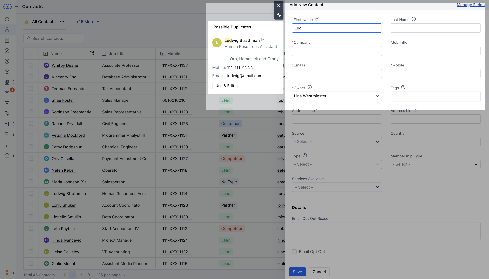

Duplicate data is painful. Anyone who’s crossed paths with another teammate unknowingly working the same account enforced rules of engagement or spent hours on an analysis deemed invalid due to data quality knows this. Outside of the pain, there are of course time and resource costs associated with each of these activities.

This duplicate management solution ensures you can avoid the above pitfalls while getting the most out of your CRM's productivity-enhancing and analytics capabilities.

So now, contact duplication is not only checked while import but also when you are creating it.

While you create a contact, it will start checking for duplicate based on the following fields:

- First Name

- Last Name

- Email and Email custom fields

- Phone / Mobile and Phone type custom fields

Thus when you type

1\. First name and last name then it will partially match the records we already have.

2\. When phone number, mobile number or other phone type filed is filled then it will match against all the phone numbers stored inside the system.

3. When email or custom email is stored then the system will check for records matching against all email fields.

So while you type we will search records and show "**Possible duplicate**" records on the side with the following info:

- Contact Name

- Designation

- Company Name

- Email

- Mobile

There will be two options with each contact:

- **Open contact in** new tab (

)to check more details

- **Click** use and edit , whereas current contact creation popup will close and contact's quick view will open up for doing further operations.
