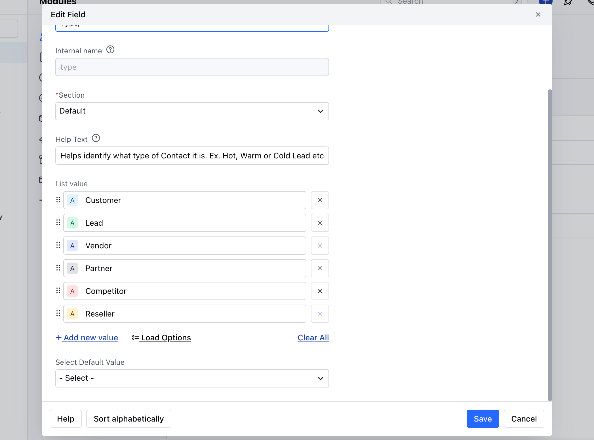
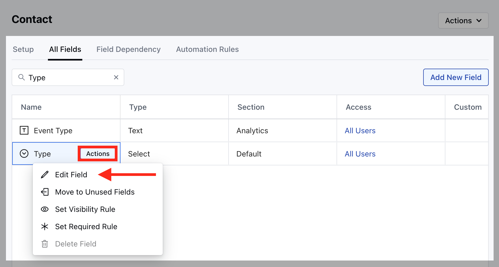

<Note>
**Note:**You will require to manage field rights to perform this action.

</Note>

Topics Covered:

* [How to Edit Contact Type](https://support.salesmate.io/hc/en-us/articles/360039390971-How-to-Edit-or-Delete-Contact-Type-inside-Salesmate#h_01J52M5MTFY7FSCGXX8EM0V2GT)

* [How to Delete Contact Type](https://support.salesmate.io/hc/en-us/articles/360039390971-How-to-Edit-or-Delete-Contact-Type-inside-Salesmate#h_01J533ZF4XAH3J46K6DB5XS73G)

### How to Edit Contact Type

To Edit Contact Type,

* **Navigate to the** Profile Icon on the top right corner

* **Click on the** Set Up

* Head Over to the**Modules**Category

* **Select the** Module (Contact, Company)

* **Go to the** All Detail Form Fields section

* **Search for** Type field and hover over it, Action button will appear

* **Click on the** Edit Field option

* **Here you can** Rename the Field or add new field.

* **Once done, hit on** Save .

### How to Delete Contact Type

To delete the Contact Type,

* **Navigate to the** Profile Icon on the top right corner

* **Click on the** Set Up

* Head Over to the**Modules**Category

* **Select the** Module (Contact, Company) **

*** Go to the**All Detail Form Fields**section.

* **Search for** Type field and hover over it,

* **Action**button will appear.

* **Click on the** Remove button to

* **Delete**the**Type**.

