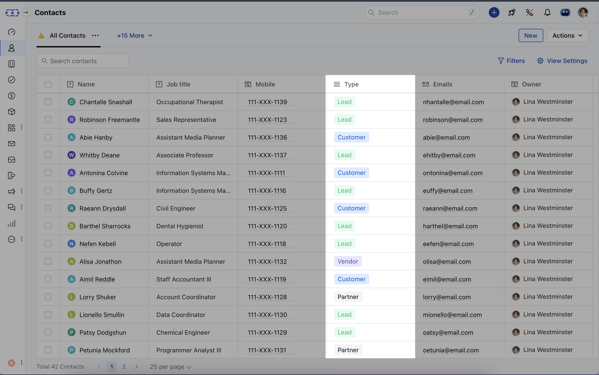
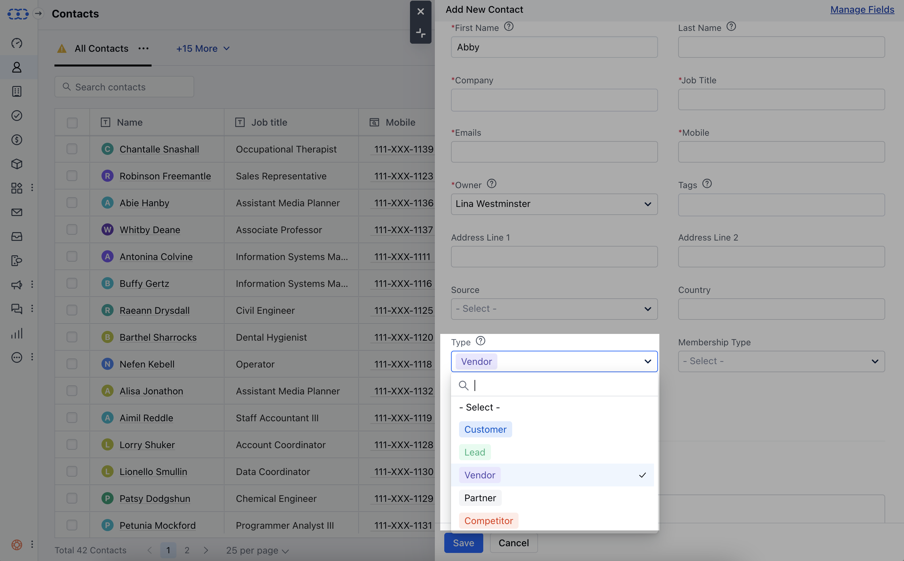
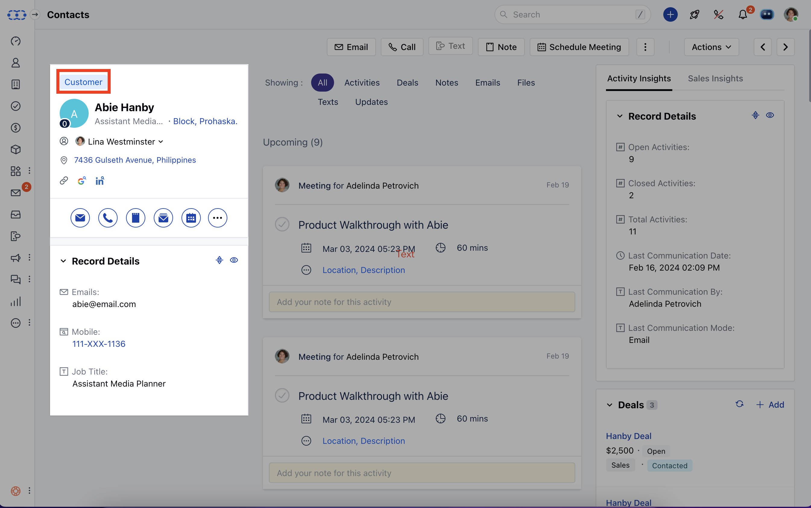
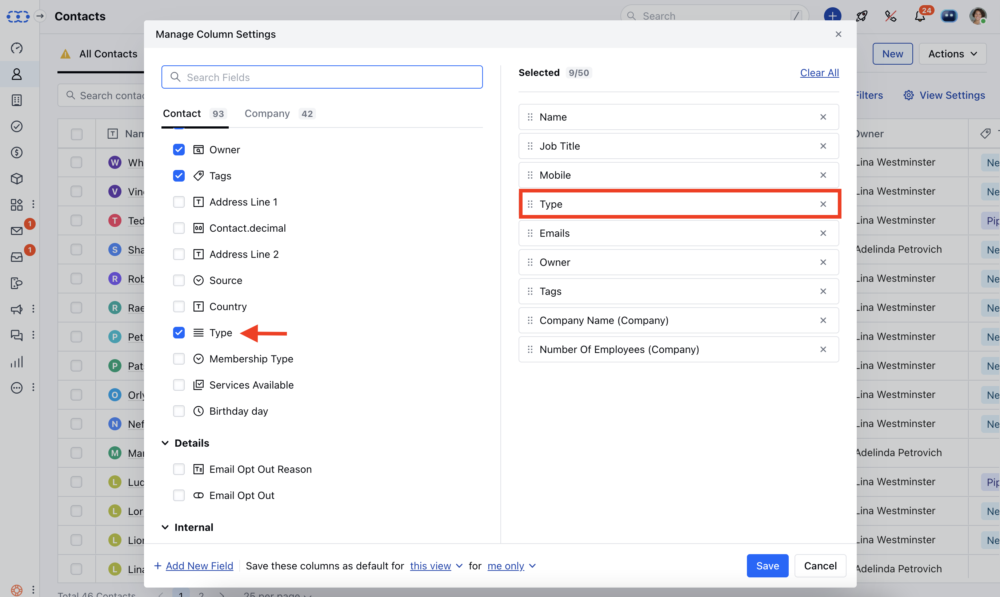

Contact types give you an additional level of categorisation to easily group, filter, or identify the customers in a better way for communication and deal tracking.

* When adding a Contact to Salesmate, you will get a dropdown to select a contact type.

* Users with manage field rights can create a new contact type and edit existing contact types. All other users can easily use and assign contact types to records.

* You can also quickly change the contact type from the contact's detail page too. The field appears above the contact name.

**View contact types in List view*** To view the contact types in the list view, you can click on the view settings button and choose contact type currently selected fields and hit Save.

**Further Reads:*** [How to add new contact types inside Salesmate?](https://support.salesmate.io/hc/en-us/articles/360039390951)

* [How to edit or delete the existing contact type inside Salesmate?](https://support.salesmate.io/hc/en-us/articles/360039390971)

<Note>
**Note:**If you can't see the contact type field inside Salesmate, then please visit Setup >> Modules >> Contact and check if the field appears inside the unused field section.

</Note>
