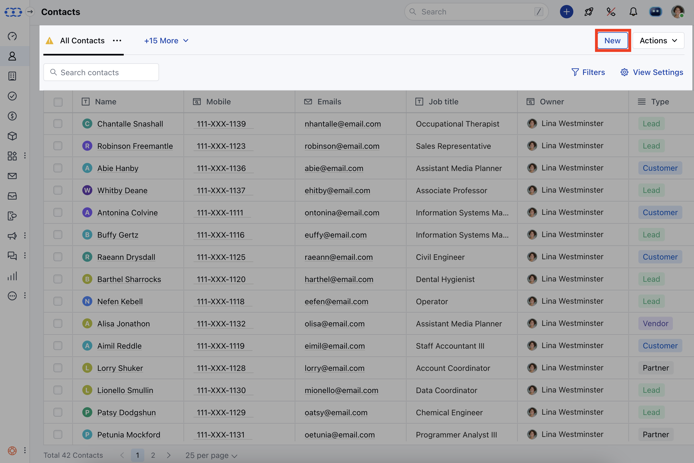
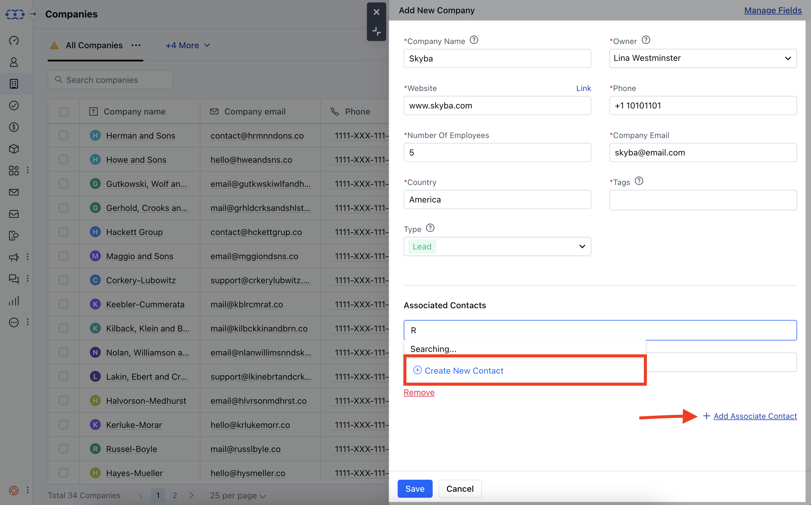
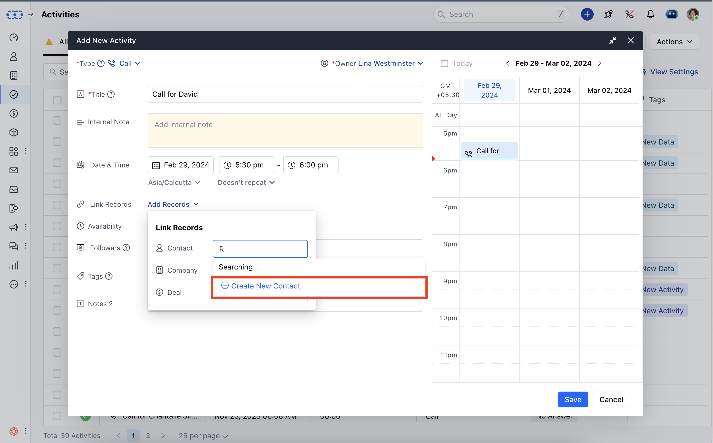
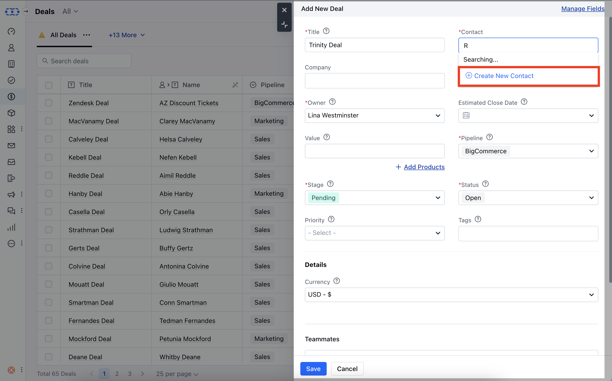
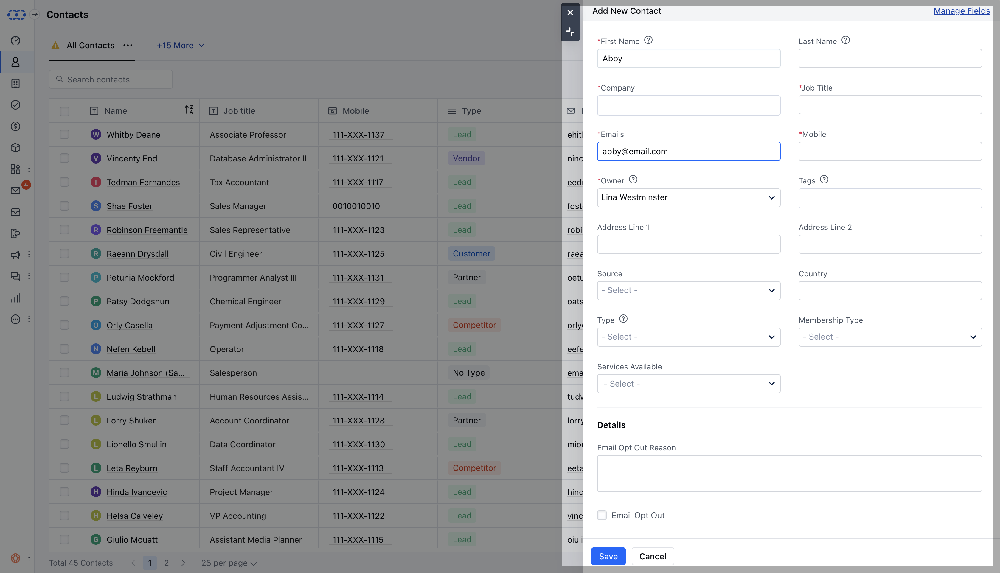

Contacts form an integral part of any Sales agent's day-to-day business interactions. They store various everlasting information related to the contact right from their mobile number, alternate phone number, email address, twitter account, facebook account, etc.

- **Contact can be a member of a** Company.

- Contacts can be your **Lead**, Enquiries which can be categorized under contacts.

- **Contact can have multiple deals open in the system at a particular point in time.

- ** Contacts can be added to the system by various methods:**Contacts **> New ( Contact Listing Page )

- **Company **> Add Associated Contact ( Add a Company Popup )

- **Activity **> Contact > Create New Contact ( Quick create a Contact )

- **Deal **> Contact > Create New Contact ( Quick create a Contact )

- **Quick Add **

<Note>

**Tip:**Contact can also be created by the shortcut key combination (**ci**). Whereas, a company can be created by the shortcut key (**cc**).

</Note>
