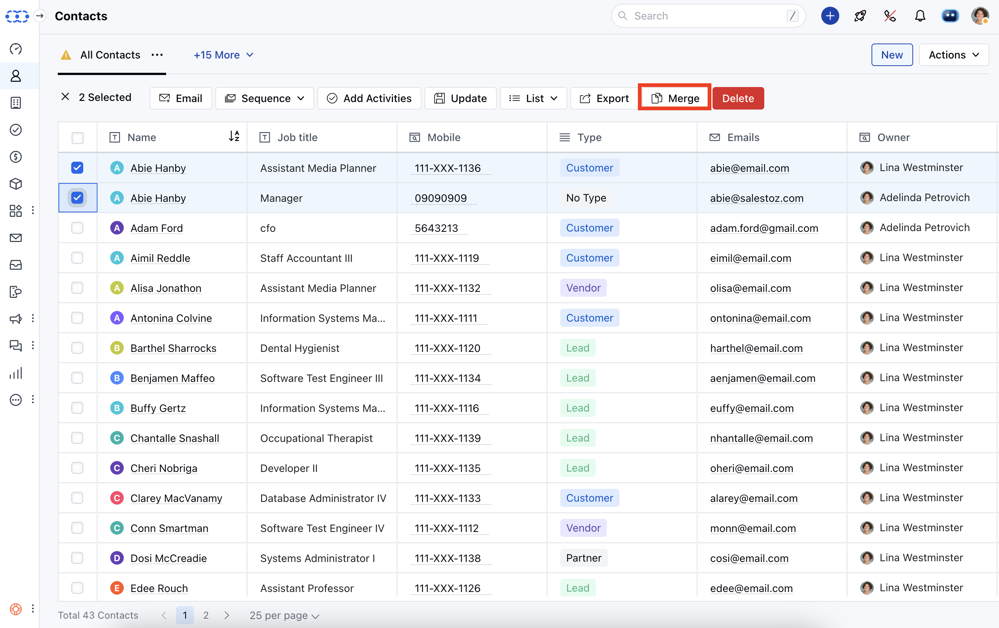
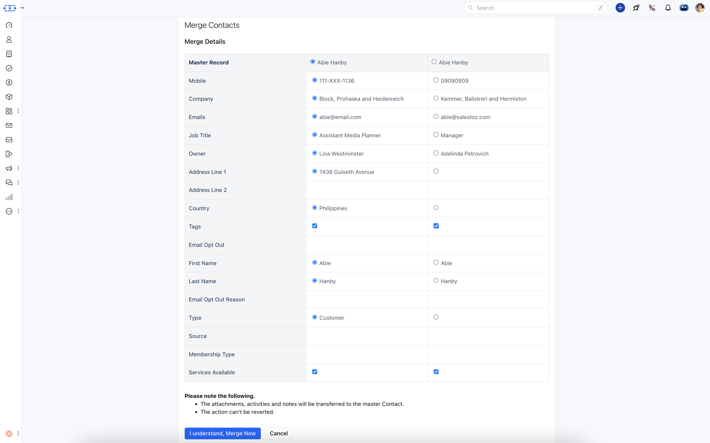

It's critical to maintain contact organisation and to keep all of your contact's information current. In some cases, merging duplicates is necessary. A contact merge joins two identical contacts into one, greatly enhancing the efficiency of your overall contact management system.

To merge contacts:

* **Go to the** Contact Listing Page

* Select the records you want to merge**(Max 3).*****Click Merge**

* **Select the fields you want to keep in your** master record.

* Click, "**I understand, Merge Now**" to combine the records.

<Note>
**Please note the following.*** The attachments, activities, and notes will be transferred to the master Contact.

* The action can't be reverted.

</Note>
