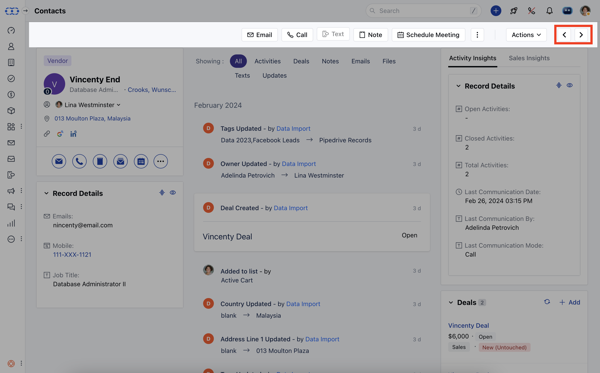
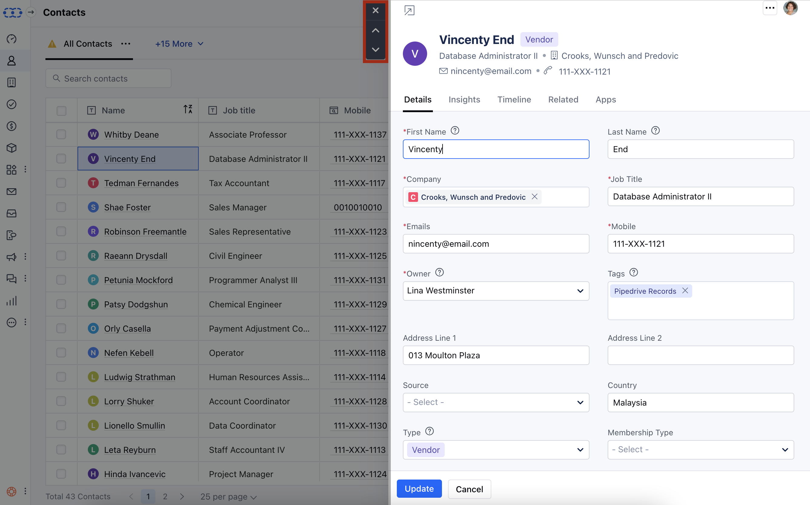

You can easily move back and forth between the records with just a single click from the record's detailed and preview page.

- **Topics covered:**

*
[How to navigate between Records from Detail View](#how-to-navigate-between-records-from-detail-view)

*
[How to navigate between Records from Preview View](#how-to-navigate-between-records-from-preview-view)

### How to navigate between Records from Detail View

To navigate between Records,

- **Navigate to the** Contact tab from the left panel.

- **Click on any one of the contacts and go to the** Detailed view of that contact.

- While you are on a detailed view page of the contact you can see the arrow symbol at the top right corner that will lead you to the previous or next contact.

### How to navigate between Records from Preview View

- **Navigate to the** contact tab from the left panel

- **Click on the** preview (an eye symbol) button beside the contact's name

- While you are on the preview page of the contact you can see the up and down arrow symbol at the top left corner that will lead you to the previous or next contact.

- **By following the same steps you can navigate between** The Companies, The Activities, and The Deals.

<Note>

**Note:** Navigation options will not be available if you have opened the record from the deal Boardview. It will be available from the list view only.

</Note>
