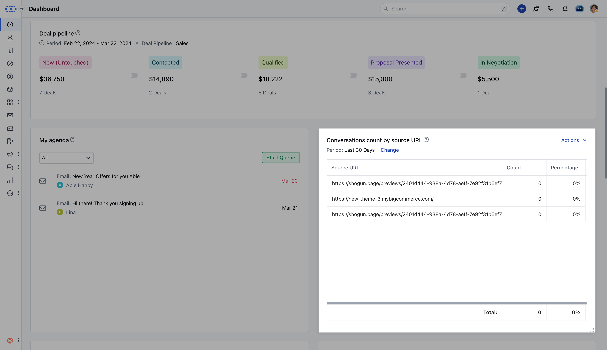

"Conversations count by source URL" is used to track and analyze the number of conversations initiated or generated from different source URLs.

If you're tracking conversations on your website, you might want to know how many of these conversations originated from different pages or URLs on your site.By analyzing the conversations count by source URL, you can identify which pages are driving the most engagement and optimize your marketing efforts accordingly.

Add this report to your dashboard by clicking on '**Add widget**' and choosing the conversations filter on the left panel then selecting the report and clicking on the '**Add to dashboard**' option.
