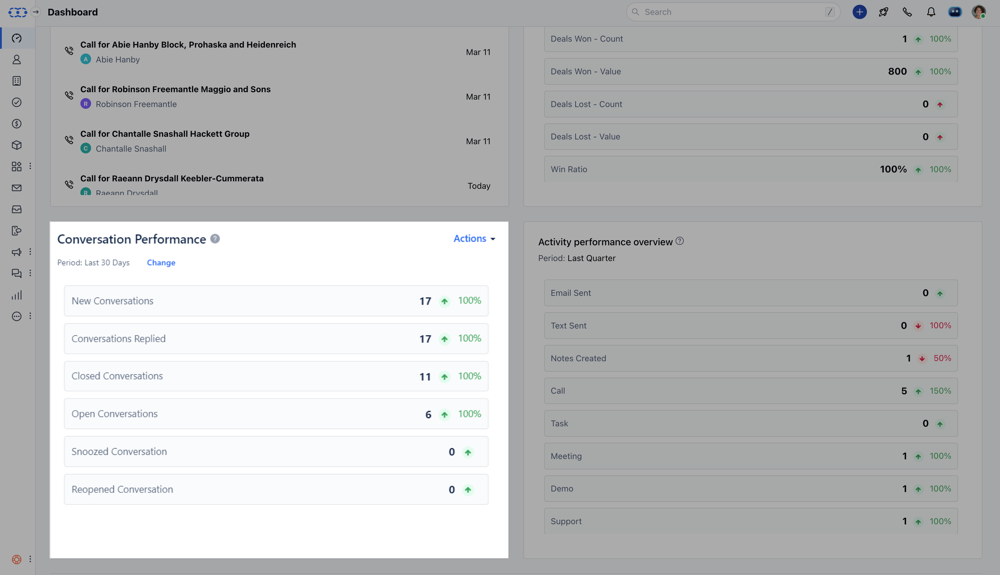

### Learn how conversations are being handled in the organization.

This report helps you understand the state of the inbox i.e. how many conversations are closed, opened, snoozed, or reopened. and how many conversations the team receives and replies to in a certain interval of time.By default, the data is displayed for the last 30 days with the following stats:**New conversations**- The total number of new conversations.**Conversations replied**- The number of conversations where a teammate replied**Closed conversations**- The number of conversations uniquely closed. If a conversation was closed more than once then it will be counted as one only.**Open conversations**- The number of conversations with the status ‘Open’, at the end of the period.**Snoozed conversations**- The number of conversations with the status ‘Snoozed’, at the end of the period.**Reopened conversations**- The number of conversations unique reopened. If a conversation was reopened more than once then it will be counted as one only.The data displayed in this summary report is a comparison of current data and previous data of the selected period to show the rise or fall in the values.

Add this report to your dashboard by clicking on '**Add widget**' and choosing the conversations filter on the left panel then selecting the report and clicking on the '**Add to dashboard**' option.
