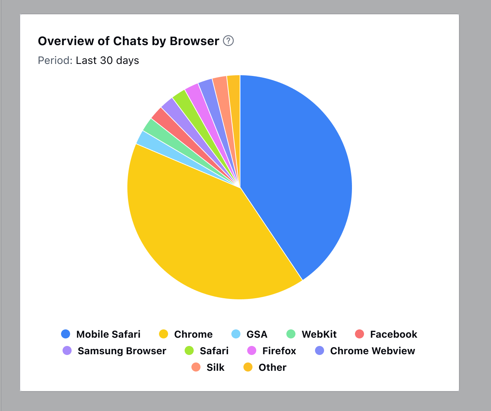

Overview of Chats by Browsers to view the percentage of conversations initiated from different browsers over a particular period

This analysis provides insights into customer preferences and behaviours regarding browser usage during chat sessions.By calculating the percentage of conversations initiated from each browser category relative to the total number of chat interactions over the specified period, you can identify trends and patterns in browser usage.This information enables businesses to optimize their website compatibility and user experience to better accommodate users based on their browser preferences.

Add this report to your dashboard by clicking on '**Add widget**' and choosing the conversations filter on the left panel then selecting the report and clicking on the '**Add to dashboard**' option.
