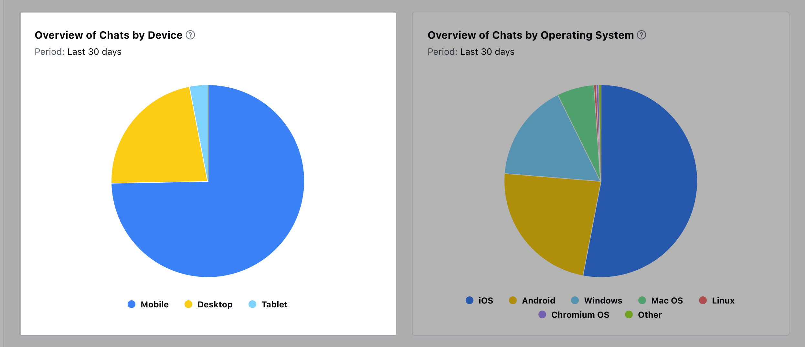

Overview of Chats by Devices helps to view the percentage of conversations initiated from different devices over a particular period.

This analysis offers valuable insights into customer preferences and behaviors regarding device usage during chat sessions.By calculating the percentage of conversations initiated from each device category relative to the total number of chat interactions over the specified period, you can identify trends and patterns in device usage.This information empowers businesses to tailor their support strategies and optimize their platforms to better cater to users based on their device preferences.

Add this report to your dashboard by clicking on '**Add widget**' and choosing the conversations filter on the left panel then selecting the report and clicking on the '**Add to dashboard**' option.
