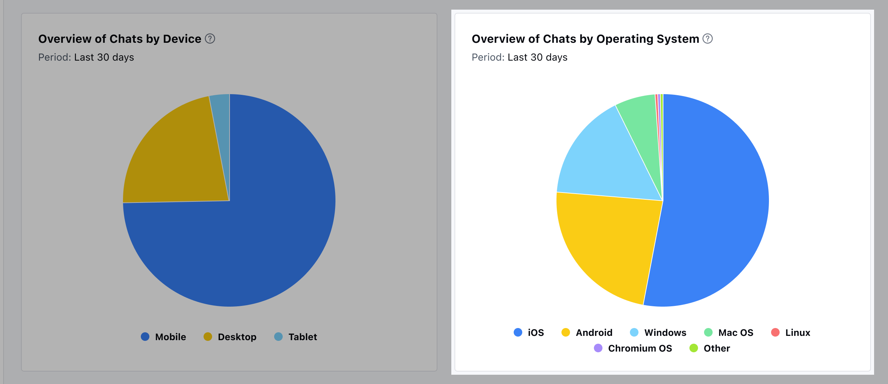

Overview of Chats by OS to view the percentage of conversations initiated from different operating systems over a particular period

Analyze chat data to understand the proportion of interactions originating from various operating systems within that timeframe.This information empowers businesses to tailor their support strategies and optimize their platforms to better accommodate users based on their operating system preferences.

Add this report to your dashboard by clicking on '**Add widget**' and choosing the conversations filter on the left panel then selecting the report and clicking on the '**Add to dashboard**' option.
