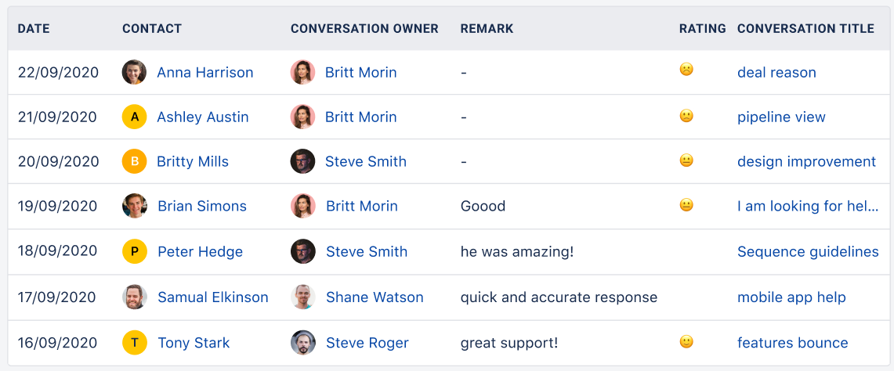

### View the recent remarks shared by the contacts for your conversations.

If you had been collecting the ratings and feedback from your customers then this report is very helpful to you as it will not only display the ratings received from all the contacts but their remarks and also the user who handled the conversation.Isn't this brilliant to understand the experience your customers had. You can now follow up with the contacts who gave poor ratings or remarks and provide them with further resolution. 😃

Add this report to your dashboard by clicking on '**Add widget**' and choosing the conversations filter on the left panel then selecting the report and clicking on the '**Add to dashboard**' option.
