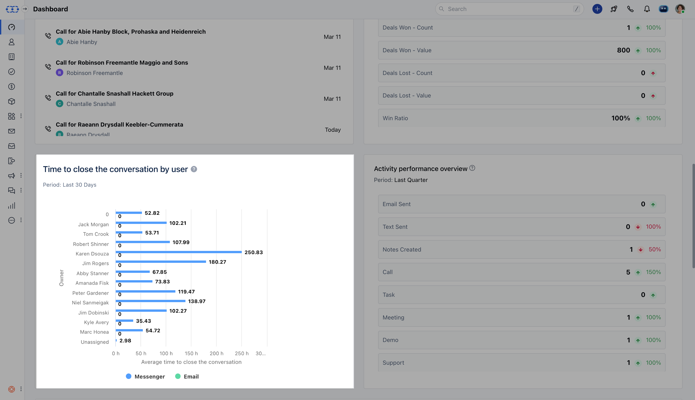

### View how long it takes for a user to close a chat conversation.

Once a conversation starts, we aim to provide absolute resolution to the customer but the resolution time is also very important. Therefore, it would be great to have this report on your dashboard which can highlight the users who close conversations at an ideal time and the ones who are taking longer than required.

Time value is calculated and displayed separately for both channels, Email & Messenger.This report can also be helpful for the manager to know which team member they need to aid the support in closing the conversation if anyone is taking too long, Isn't this great? 😀

Add this report to your dashboard by clicking on '**Add widget**' and choosing the conversations filter on the left panel then selecting the report and clicking on the '**Add to dashboard**' option.Try filters like time or users to view the report accordingly.
