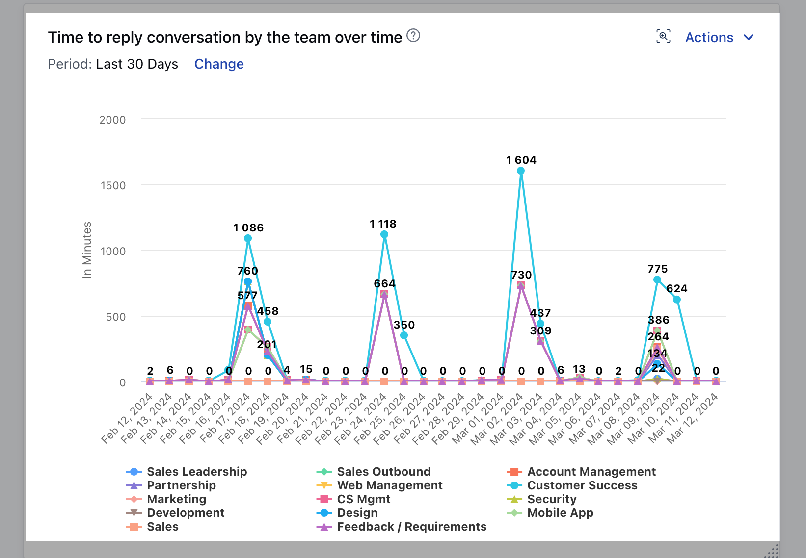

###  View how long it took for each team to post the first reply to an initial conversation.

This report measures the average first response time by the team members who are responsible for replying to the customer's queries. Therefore, it would be great to have this report on your dashboard which can highlight the teams that reply quickly and the teams whose responses are delayed.This report is very helpful for the manager to know the performance of the various teams. 😀

Add this report to your dashboard by clicking on '**Add widget**' and choosing the conversations filter on the left panel then selecting the report and clicking on the '**Add to dashboard**' option.Try filters like time or teams to view the report accordingly.
