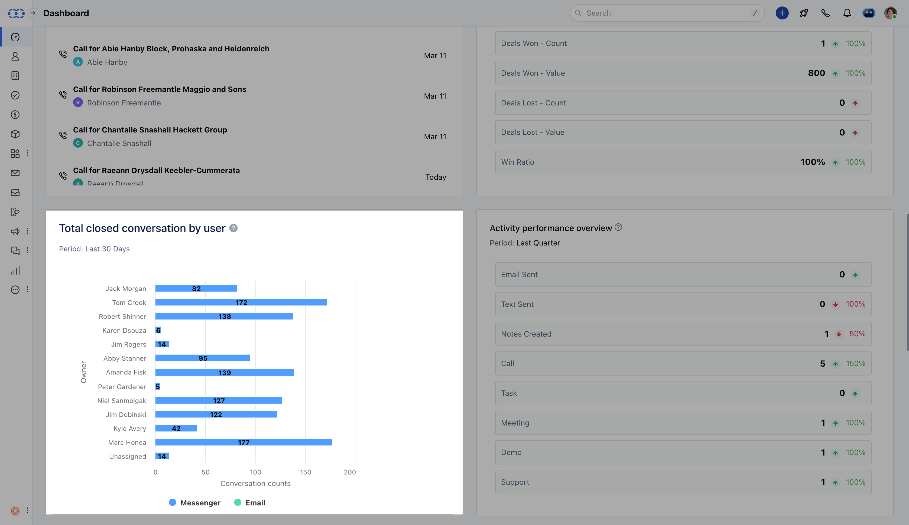

###  View the total count of conversations closed by the users.

This report provides a basic overview of the count of conversations that have been marked as closed by each user.

Each conversation has a unique closed count that is, if a conversation is closed multiple times then the count will only increase the count by 1 and **not** multiple times.The number of closed conversations is the total count of conversations that have been closed by each user,**not** the conversations that are presently closed and assigned to the user.The counts are also shown for the conversations done via the Email channel.

Add this report to your dashboard by clicking on '**Add widget**' and choosing the conversations filter on the left panel then selecting the report and clicking on the '**Add to dashboard**' option.Try filters like time, period or users to view the report accordingly.
