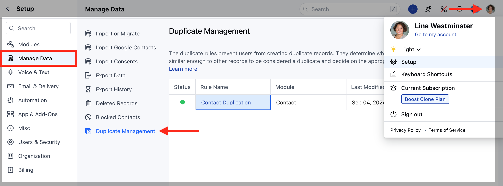
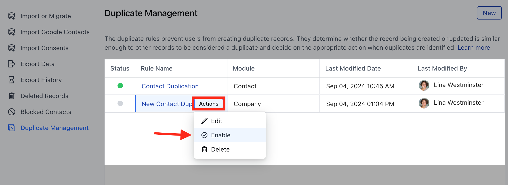
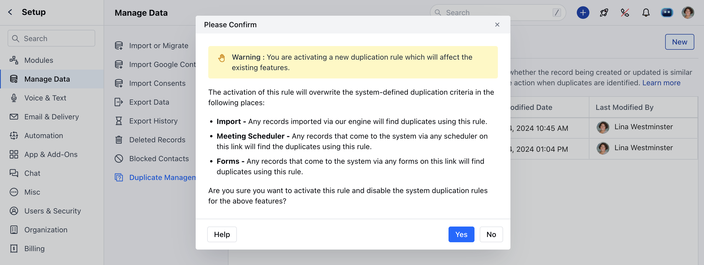
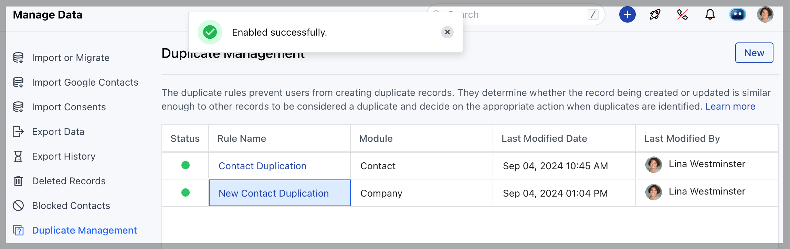
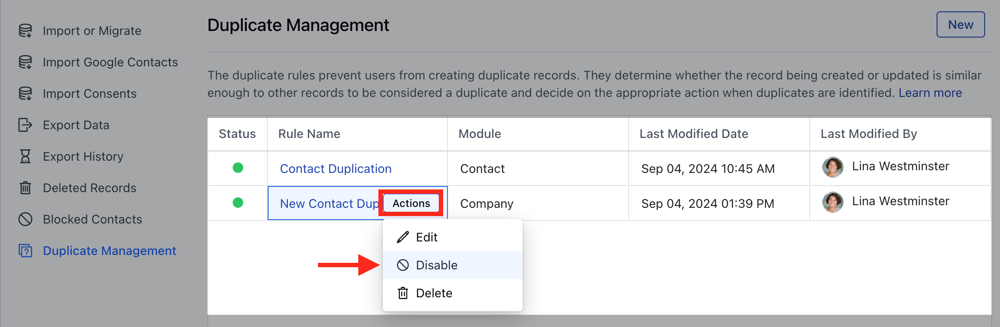
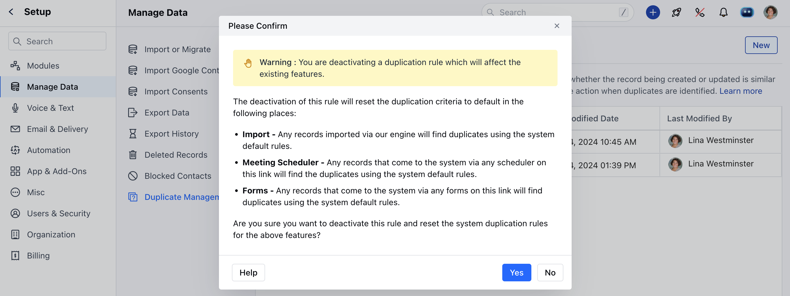

After creating the Duplicate Rule, you’ll need to activate it to start enforcing the rule.**Note:**A User with Manage Duplicates rights can perform this action.**Topics Covered:**[Activate the Duplicate Rule](https://support.salesmate.io/hc/en-us/articles/35709053685401-Activating-Deactivating-Duplicate-Rule#h_01J6Y839W484NCXQ0C2YZ30X3S)[Deactivate the Duplicate Rule](https://support.salesmate.io/hc/en-us/articles/35709053685401-Activating-Deactivating-Duplicate-Rule#h_01J6Y83PVRF2D9KH3MCKNG48VD)

### Activate the Duplicate Rule

To Activate Duplicate Rule,

Navigate to the**Profile Icon**on the top right corner.Click on the**Set Up.**Head over to the**Manage Data**category.Click on the**Duplicate Management**option.

Select the rule and hover on it.An**Actions**button will appear, click on it and choose**Enable**to activate the rule.

A popup will appear with the following warnings:

The activation of this rule will overwrite the system-defined duplication criteria in the following places:**Import:**Any records imported via our engine will find duplicates using this rule.**Meeting Scheduler:**Any records that come to the system via any scheduler on this link will find the duplicates using this rule.**Forms:**Any records that come to the system via any forms on this link will find duplicates using this rule.

Are you sure you want to activate this rule and disable the system duplication rules for the above features?

Click**Yes**to confirm and enable the rule.You’ll see a success message**Enabled successfully.**

### Deactivate the Duplicate Rule

To Deactivate Duplicate Rule,

Navigate to the**Profile Icon**on the top right corner.Click on the**Set Up.**Head over to the**Manage Data**category.Click on the**Duplicate Management**option.

Select the rule and hover on it.An**Actions**button will appear, click on it and choose**Disable**to deactivate the rule.

A popup will appear with the following warnings:

Once you confirm the Rule will be successfully Deactivated.
