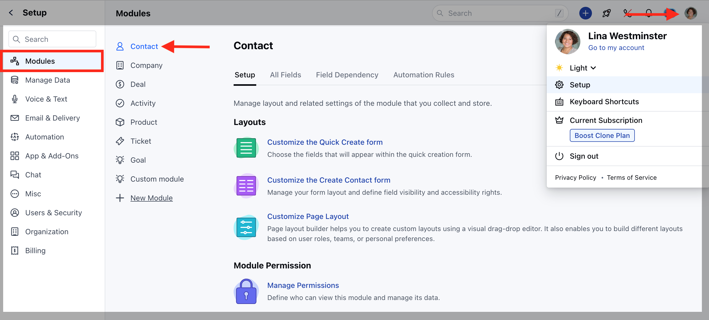
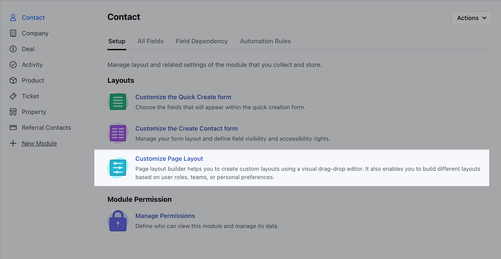
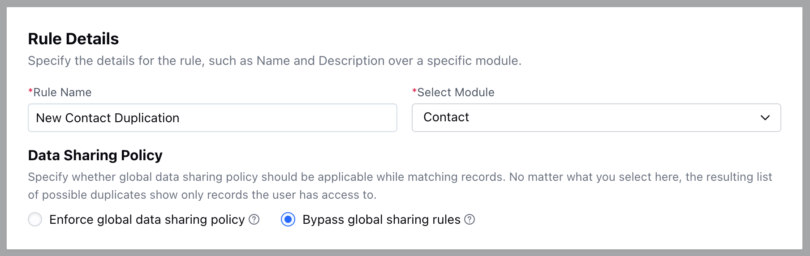
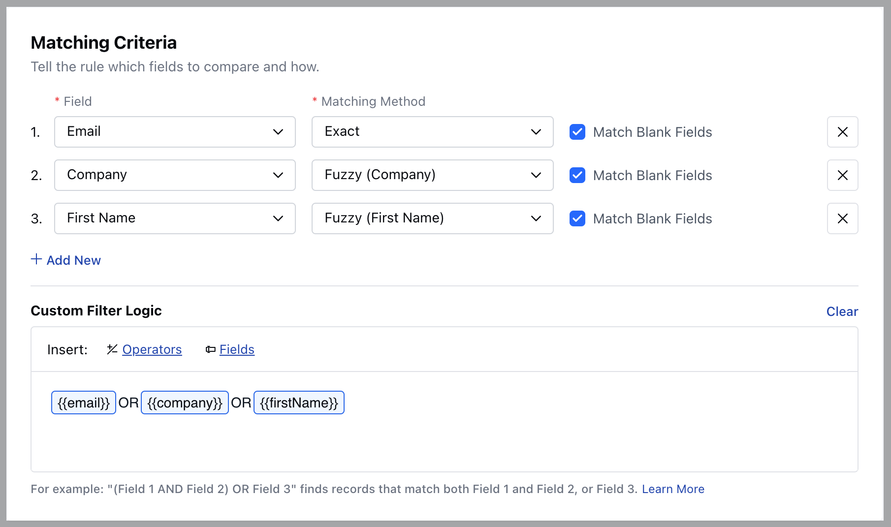
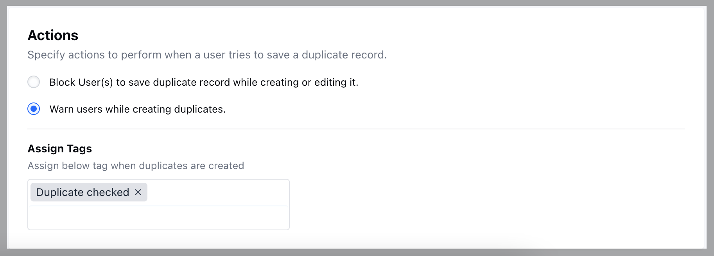

A Duplicate Rule in Salesmate is a set of criteria that helps the system identify and manage duplicate records.

- **Note:** A User with Manage Duplicates rights can perform this action.

### How to Set Duplicate Rules

To set Duplicate Rules,

Navigate to the **Profile Icon** on the top right corner.Click on the **Set Up.

- ** Head over to the **Manage Data** category.Click on the **Duplicate Management** option.

Click on **"New"** to create a new Duplicate Rule.

Here, you would need to add the following details,

- [Rule Details](#rule-details-rule-name-enter-a-name-for-your-duplicate-rule)
- [Matching Criteria](#matching-criteria)
- [Actions](#rule-details-rule-name-enter-a-name-for-your-duplicate-rule)

### Rule Details- **Rule Name:** Enter a name for your Duplicate Rule.

- **Select Module:** Choose the Module (Contacts, Companies) where this rule will apply.

- **Data Sharing Policy:** Define how the rule will handle data sharing and visibility within your team.

- **Enforce global data sharing policy:** The duplication check will be performed against only the records a user can view within the selected module.

- **Bypass global sharing rules:** The duplication check will be performed against all records within your organization for the selected module, regardless of individual user permissions.

### Matching Criteria

- **Field:** Choose the specific field(s) in the module that the system will check for duplicates

- **Matching Method:** Select from the following options,
- **Fuzzy:** The system will perform a loose match, identifying similar but not necessarily identical records

- **Exact:** The system will look for an exact match, where the field value must be identical.

- **Match Blank Fields:** Decide whether the system should consider blank fields as potential duplicates.

- **Custom Filter Logic:** Define specific conditions or logic for how the system should match and identify duplicates based on your chosen fields.

### Actions **Block User(s) to save duplicate record while creating or editing it:** Prevent users from saving a record if it matches an existing one while creating or editing.

- **Warn users while creating duplicates:** Display a warning message to users if they attempt to create a record that matches an existing one, allowing them to review before saving.

- **Assign Tags:** Automatically assign specific tags to records identified as duplicates for easier tracking and management.

Once done, Save the informationThat's it your new Rule is now created.Once the Rule is created you would then need to activate the rule.
[Learn More](#actions-block-users-to-save-duplicate-record-while-creating-or-editing-it-prevent-users-from-saving-a-record-if-it-matches-an-existing-one-while-creating-or-editing)

- **Note:** Currently, you can create one Duplicate Rule per module.
