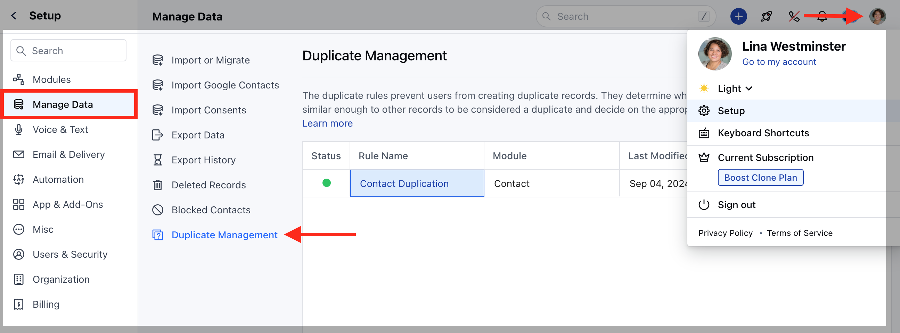
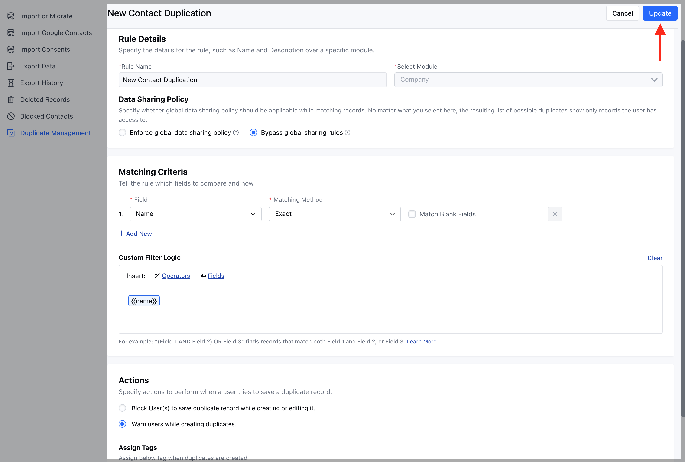
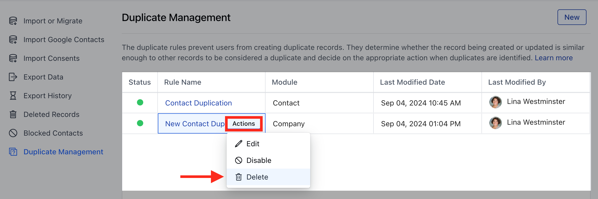
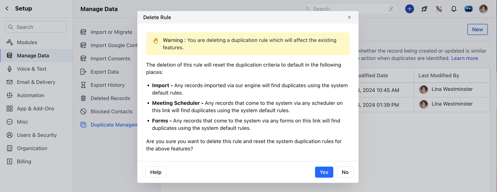

After Creating the Duplicate Rule, you also get an option to Edit and Delete the Duplicate Rule**Note:**A User with Manage Duplicates rights can perform this action.**Topics Covered:**[Edit the Duplicate Rule](https://support.salesmate.io/hc/en-us/articles/35709100249497-Manage-Duplicate-Rule#h_01J6Y401CN4SWYTXQJJT6EA44F)[Delete the Duplicate Rule](https://support.salesmate.io/hc/en-us/articles/35709100249497-Manage-Duplicate-Rule#h_01J6Y6ZRD0XBSJXTB5HARB6A35)

### Edit the Duplicate Rule

To Edit the Duplicate Rule,

Navigate to the**Profile Icon**on the top right corner.Click on the**Set Up.**Head over to the**Manage Data**category.Click on the**Duplicate Management**option.

Select the rule and hover on it.An**Actions**button will appear, click on it and choose**Edit**option

Here, you won’t be able to update the**Rule Name**or change the**Selected Module**. You can make the necessary changes and click**Update**to save them.

### Delete the Duplicate Rule

To  Delete the Duplicate Rule,

Navigate to the**Profile Icon**on the top right corner.Click on the**Set Up.**Head over to the**Manage Data**category.Click on the**Duplicate Management**option.

Select the rule and hover on it.An**Actions**button will appear, click on it and choose**Delete**option

A confirmation popup will be displayed:The deletion of this rule will reset the duplication criteria to default in the following places:

Import - Any records imported via our engine will find duplicates using the system default rules.Meeting Scheduler - Any records that come to the system via any scheduler on this link will find duplicates using the system default rules.Forms - Any records that come to the system via any forms on this link will find duplicates using the system default rules.

Are you sure you want to delete this rule and reset the system duplication rules for the above features?

Confirm the delete operation by clicking on**Yes**button.

The rule will be successfully deleted.
