The Potential Duplicate Widget provides details about any possible duplicate records directly on the record’s detail page. This allows you to easily identify and review duplicate entries related to the specific record you're viewing.

- **Note:** This widget won’t be added to the layout automatically. You’ll need to manually add it to the record’s detail page if you want to use it.

- **Topics covered:** -
- [How to Add Potential Duplicate Widget to the Layout](#how-to-add-potential-duplicate-widget-to-the-layout)

- [How would it appear on Records Detail Page](#how-it-would-appear-on-records-detail-page)

- [Understanding the difference between Message View and Widget View:](#understanding-the-difference-between-message-view-and-widget-view)

### How to Add Potential Duplicate Widget to the Layout

To add the Potential Duplicate Widget to the Layout,

Navigate to the **Profile Icon** on the top right corner.Click on the **Set Up** Head over to the **Modules** Category and select the required **Module (Contact, Company).

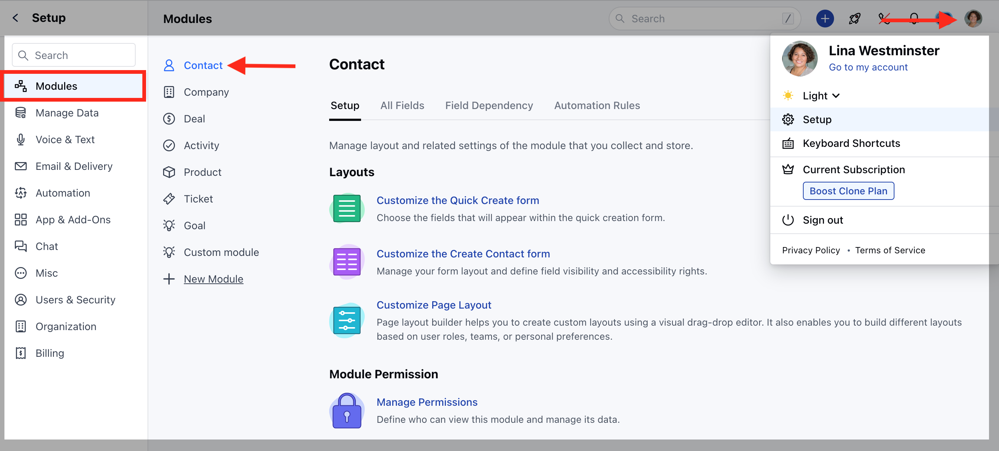

Select **Customize Page Layout** option.

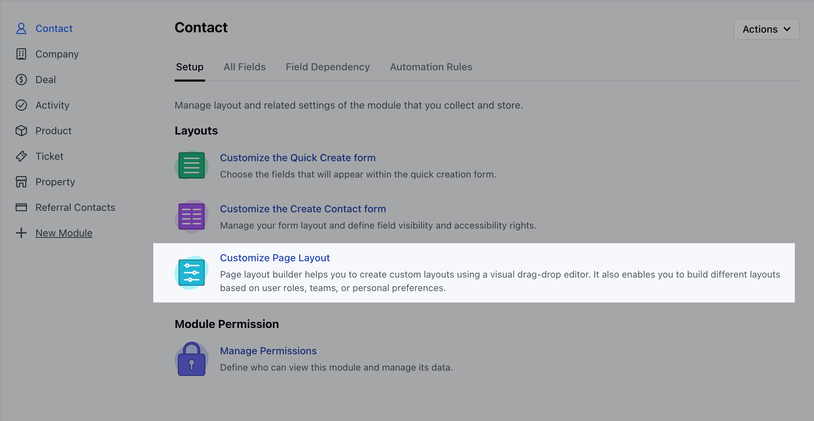

You can either edit an existing layout or add this widget when creating a new layout.

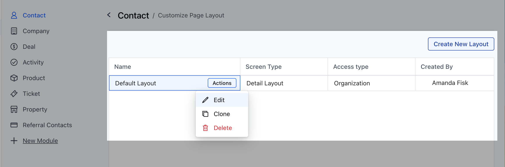

Or

Navigate to the **Contact/ Compan** y ModuleSelect a record to open the record Detail screen.Click on the Actions button on the top right corner and select the **Customize Layout** option

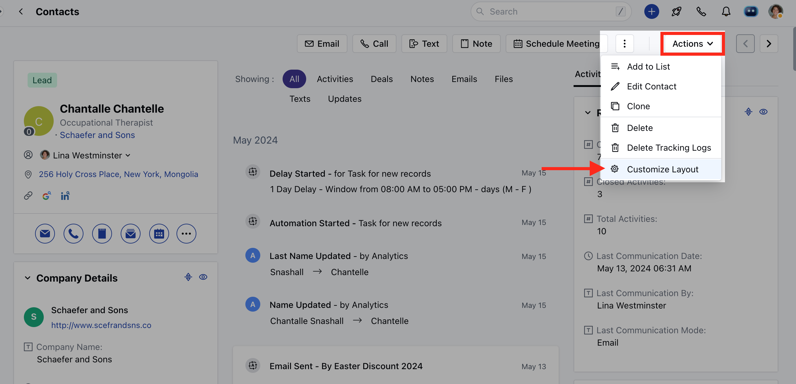

Simply drag and drop the **Potential Duplicate Widget** to the layout.

### How it would appear on records detail page:

Once you drag and drop the Potential Duplicate Widget into the layout, you get a few options to customize the widget.
The available customization options are:**Renaming the widget:**This allows you the flexibility name this widget.

- **Appearance**: Message View or Widget View.
- [Learn More about Message View](https://support.salesmate.io/hc/en-us/articles/37274699825049-Potential-Duplicate-Widget#h_01JE47K6XHX54H96ZC57VHND3G)
- [Learn More about Widget View](https://support.salesmate.io/hc/en-us/articles/37274699825049-Potential-Duplicate-Widget#h_01JE48CT4GG6TPKRSH12G1CF7A)
**Auto Hide**: You can use this option to hide the widget from the layout when no duplicate is found for a record

- **Visibility Rule:** This allows you flexibility about when or to which user in the organization should be able to view the duplicate record.

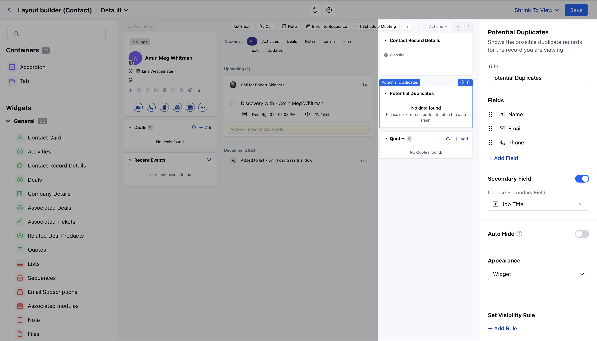

### Understanding the difference between Message View and Widget View:

####

- **Message View:** When you select the **Potential Duplicate Widget** to appear in message view, you will be able to see a message on your layout when a duplicate is found. The message would read as "**We found 1 potential duplicates for this Contact**".

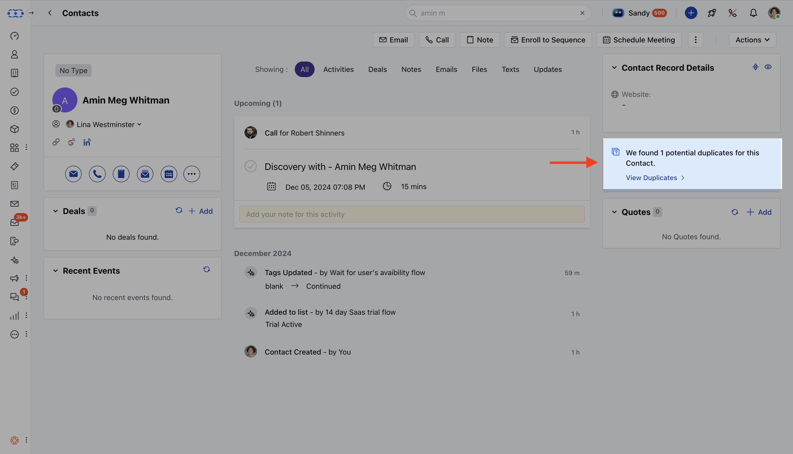

To proceed further to view the duplicate or to take action

Click on "**View Duplicates**"This would open a pop-up where you can perform different actions i.e. View the record, Delete the record or Compare & Merge the record

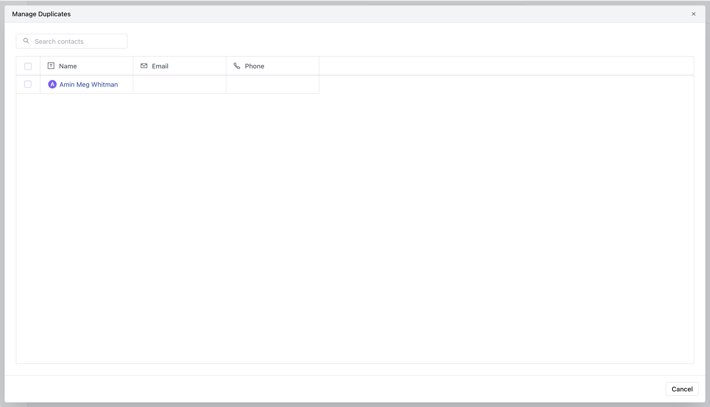

After viewing the record, if you choose to merge the record, select "Compare & Merge"Selecting "Compare & Merge" will take you to the pop-up where you can select which details from the found duplicates should be kept after they are merged.

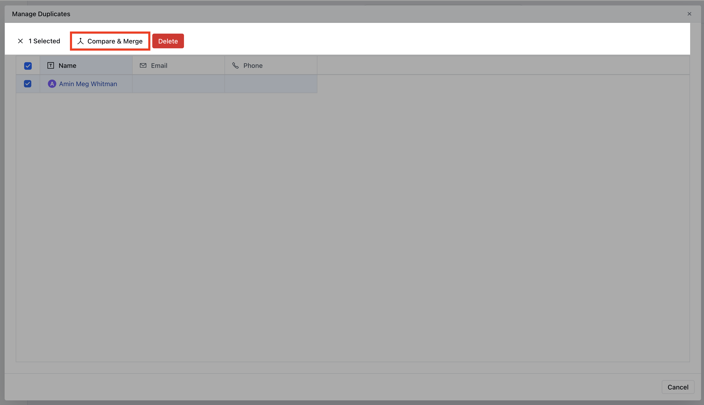

Choose your preferences and hit **"Merge now"**.

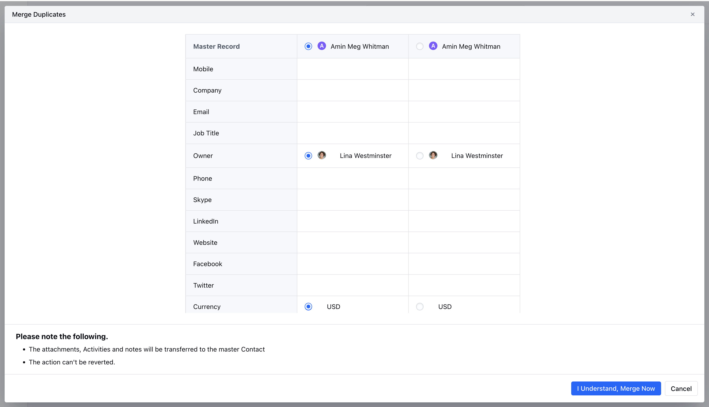

Once merged, you should see a success message "Contact(s) merged successfully.

####**Widget View:**Apart from the message view, you get the option to view the "**Widget**" in detail View. Within the widget view, you also get the option to choose what fields of the record should appear within the layout when a duplicate is found.To configure this,

Select "**Widget**" under Appearance for **Potential Duplicate Widget** Select the preferred fields which should appear within detailed view of the record when a duplicate is found and hit "Save".

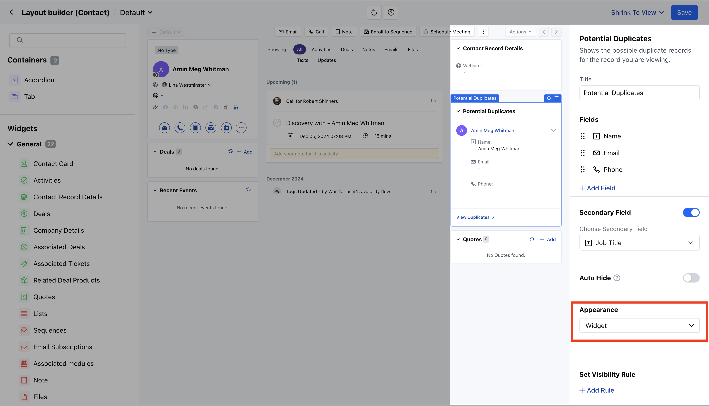

Once configured, when a duplicate is found the "**Widget View"**will display the first field chosen under fields and the secondary field if enabled. You can further expand the widget view to see the additional details of the record.There are a few quick actions that you can perform from the Widget View when a duplicate is found in a detail layout.

Go to the detailed view of the duplicate recordClick on the three-dot icon to view the **"Merge" or "Delete"** options for the duplicate recordsExpand the view to see the complete/configured fields of the duplicate record.

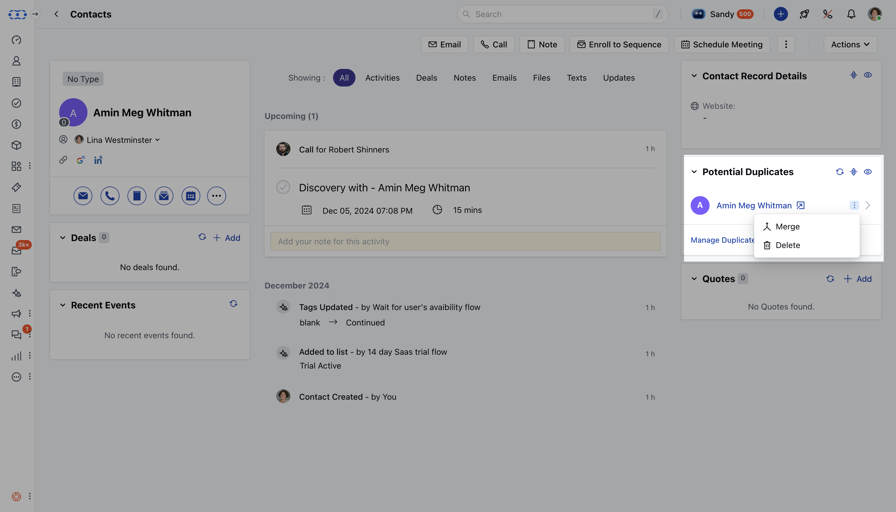

To proceed further to take an action,

Click on "**Manage Duplicates**"This would open a pop up where you can perform different actions i.e. View the record, Delete the record or Compare & Merge the recordAfter viewing the record, if you choose to merge the record, select "Compare & Merge"

Selecting "Compare & Merge" will take you to the pop up where you can select which details from the found duplicates should be kept after they are merged.Choose your preferences and hit "Merge now".

Once merged, you should see a success message "Contact(s) merged successfully.

- **Note:**Currently it is not possible to configure/add fields when you choose to view the "Potential Duplicate Widget" in "Message View"You will need to configure a duplicate rule if you choose to view duplicates under this widget.

[Click here](https://support.salesmate.io/hc/en-us/articles/35708698771993-How-to-Create-Duplicate-Rules)
to learn about configuring a duplicate rule
