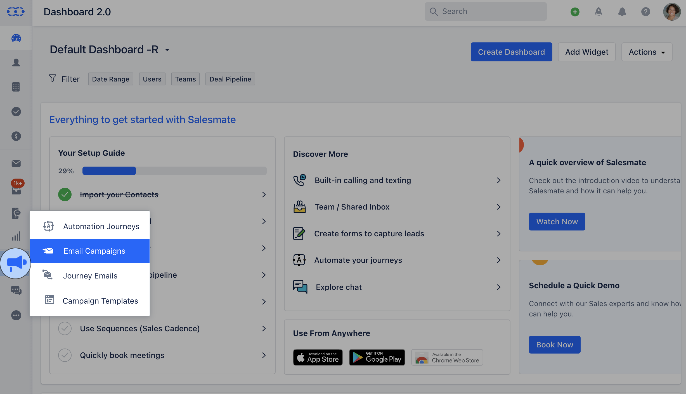

An A/B test is a way to compare different versions of an email you send to people. It helps you figure out which version of the email gets the most attention and interest from the recipients. The system will pick a winning email version and send it to the rest of the contacts based on how those emails perform over a defined time.To know more about A/B Testing, [Click Here](https://support.salesmate.io/hc/en-us/articles/19889936744857) To locate Open Tracking by Top Locations report, follow these steps:

Navigate to the **Outreach **Icon** on the left Menu bar.Click on** Email Campaigns.***

- *Click on the** Campaign **that you would like to check A/B Test Results for.**

- *Navigate to the**"Insights"**section.In the insights section, you will find all the reports related to the email campaign.Scroll down for the**"A/B Test Results"** report, which will help you figure out which version of the email got the most attention and interest from the recipients.

The report will have the following information:- **Variant:** It shows the different versions of the email, with the number of rows for each version.There can be a minimum of two and a maximum of three variants.

- **Subject:** It displays the subject of each email variant.

- **Delivered:** This number represents how many contacts received each email variant in their inbox.

- **Opened (Opened rate):** This indicates the overall count of how many times the email variant was opened by recipients. recipient can open an email multiple times, and each instance is added to the total count.
 Opened Rate: It represents the percentage of contacts who opened the email variant out of the total number of emails delivered.

- **Clicked (Clicked rate):** This indicates the total number of clicks performed by recipients on the links included in the email variant (the recipient can click multiple times on links included in the email and each click is added to the total number).
 Clicked Rate: It represents the percentage of contacts who clicked on the links included in the email variant out of the total emails delivered.

- **Clicked Through Rate:** It represents the percentage of contacts who clicked on a link in the email variant out of the number of contacts who opened the email.

- **Unsubscribed:** This number shows how many contacts unsubscribed from a particular campaign variant.The winning variant will be marked with a **Trophy** symbol.The report will also include a doughnut chart, which illustrates the AB split that was sent and the number of emails sent to the winning variant.

Please note that if the test was conducted with a 100% sample, there won't be a winning variant, and no trophy symbol or winning variant will be displayed in the report.

Each variant will display the percentage of the number of emails sent.The winning variant will display the percentage of the remaining emails sent.

