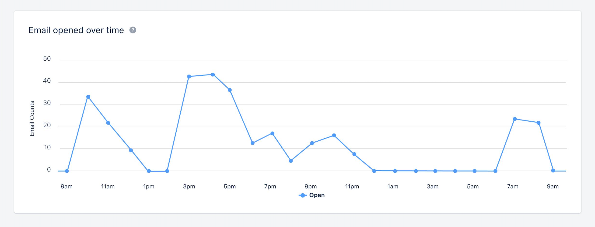
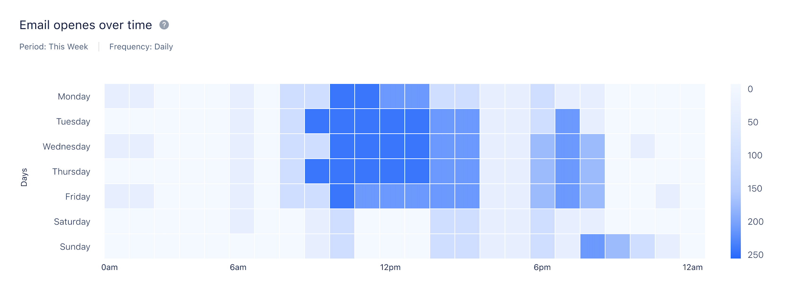

It's helpful in analyzing the first 24-hour performance report of the campaign, user can view data that reveals the busiest time of the day, indicating when they receive the highest number of opens.**To View Email opened over time :**Navigate to**Outreach****Icon**on the left Menu bar.Click on**Email Campaigns.****

**Click on the**Campaign**that you would like to get insights into**Email Opened Over Time**.

**Difference between Reports in Campaigns and Journey Emails.**Reports in Juourney Emails are advanced and will appear as Heatmaps. The areas that are highlighted in Heatmaps are based on the counts.**Reports in Campaigns:**

**Reports in Journey Email:****

**
