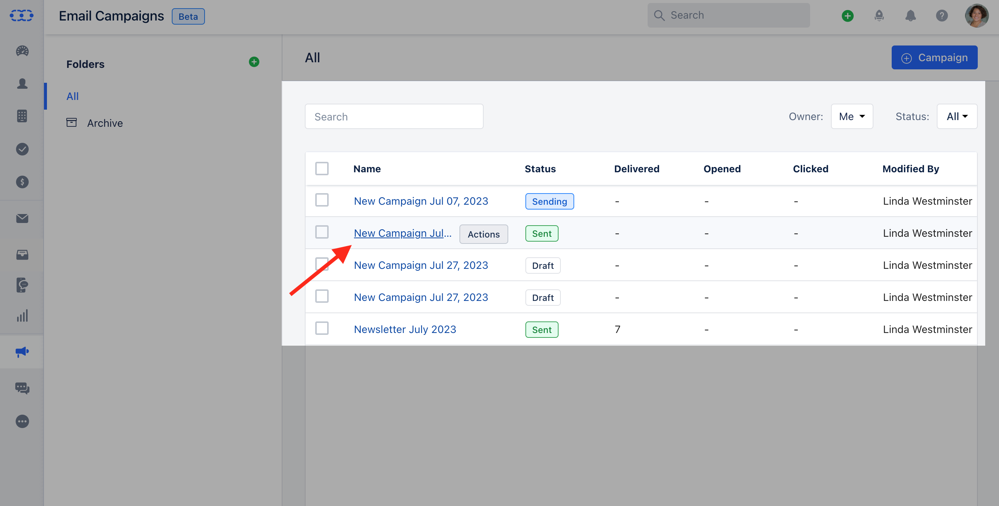
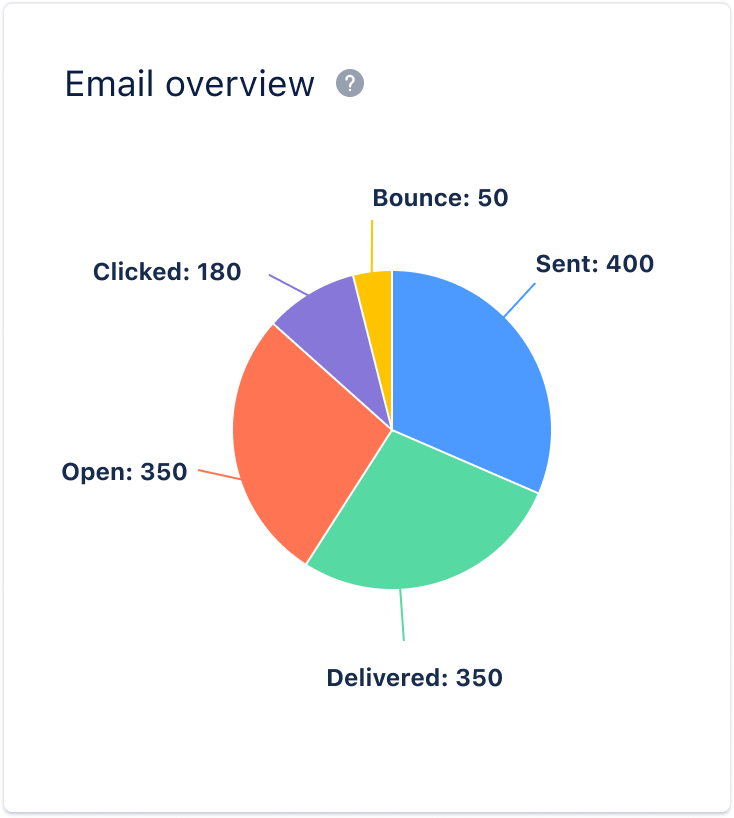

Email overview refers to a summary or snapshot of key metrics and statistics related to an email campaign or a series of emails. It provides a high-level view of how the emails have performed and allows users to understand the effectiveness and impact of their email communications.

- **To View the Email overview:** Navigate to the** Outreach **Icon** on the left Menu bar.Click on** Email Campaigns.***

- *Click on the** Campaign **that you would like to get the Insights into** Email Overview **.

###  What are the stats that Email Overview shows?

An email overview typically includes various metrics such as:- **Sent:** The total number of emails sent out during a specific time.

- **Delivered:** The number of emails that successfully reached the recipients' inboxes without bouncing.

- **Opened:** The number or percentage of recipients who opened the email.

- **Clicked:** The number or percentage of recipients who clicked on links within the email, indicating engagement and interest.

- **Bounced:** The number or percentage of emails that were not delivered to the recipients due to various reasons such as invalid email addresses or technical issues.

###  Difference between reports in Campaigns and Journey Emails.

This report on Journey Emails will be the same except for one difference, i.e., filters. We need to add the following filters to this report:

Period: You can Select the Period by default it's the last 30 days.Frequency: You can select the frequency by default it's Daily.

- **Report on Email Campaign:** 
- **Report on Journey Emails:** 
