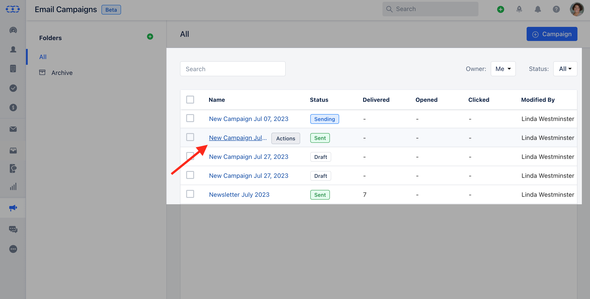
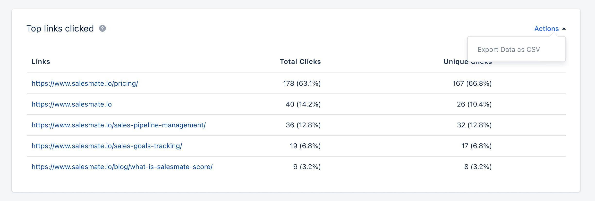
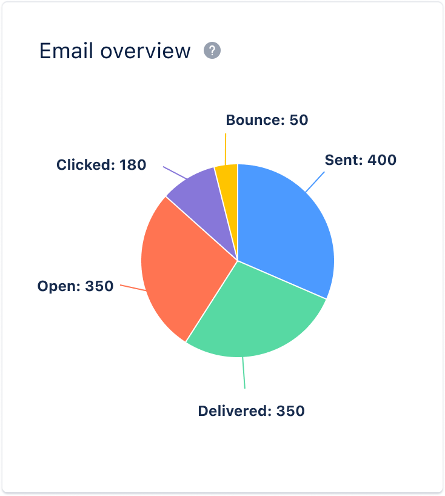

Email Performance Over Time report will provide an overview of the email campaign's performance, including metrics such as opens and clicks. Additionally, it will highlight the specific days when the campaign received the highest number of opens and clicks.Analyzing this data can help you plan the most effective times for your future campaigns.**To View the Email Performance Over Time:**Navigate to the**Outreach****Icon**on the left Menu bar.Click on**Email Campaigns.****

**Click on the**Campaign**that you would like to get insights of**Email Performance Over Time**.**

**### What Stats are to be measured?

An email overview typically includes various metrics such as:**Sent -**This is the total number of emails that were sent out during the selected time period.**Delivered -**This number shows how many contacts got the campaign delivered to their inbox.**Opened -**The total number of opens of emails by recipients (the recipient can open an email multiple times and each open is added to the total number).**Clicked -**The total number of clicks performed by recipients on the links included in emails (the recipient can click multiple times on links included in the email and each click is added to the total number).**Bounced -**The total number of contacts who did not receive the campaign.

### Difference between Reports in Campaigns and Journey Emails.

 This report for Journey Emails will be the same except for one difference, i.e. filters. We need to add the following filters to this report:

Period: Select the period, by default, we use the Last 30 daysFrequency: Select the frequency, by default we use Daily.**Report in Email Campaign:**

**Report in Journey Email:**

### How to Export this Report?

This report can be exported in both Email Campaigns and Journey Emails. To export this report follow these steps :

Click on the**Action**Option.Click on**Export Data**as CSV.

