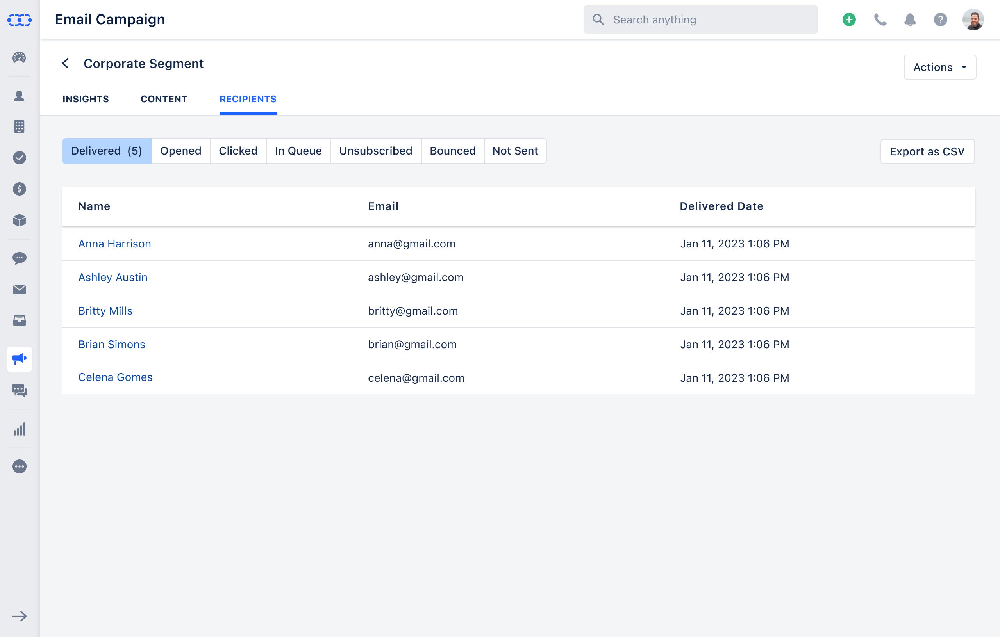

Once the Campaign is sent Salesmate allows you to get Recipient Insights with related stats.To view the**Recipients Insights**,

Navigate to the**Outreach****Icon**on the left Menu bar.Click on**Email Campaigns.****

**Click on the**Campaign**that you would like to get the insights for.

Head over to the**Recipients**section Here you get the details of Recipients as per the email status.**Delivered**\- It displays the details of the contacts to whom the campaign was delivered to their inbox. The delivered section would have the details of the Contact**Name, Email & the Delivery Date****Opened**\- It displays the details of the contacts who opened the campaign emails at least once. The Opened section would have the details of the Contact**Name, Email, Count of Opens & Last Opened Date/Time****Clicked**\- It displays the details of the contacts who clicked at least once on the links embedded in the email campaign. This section would have the details of the Contact**Name, Email, Count of Clicks & Last Clicked Time/Date****In Queue**- It displays the details of the contacts to whom the campaign is not sent yet i.e. who are still in the queue. This section would have the details of the Contact**Name & Email.****Unsubscribed**\- It displays the details of the contacts who have unsubscribed from the email campaign. This section would have the details of the Contact**Name, Email & Unsubscribed Date****Bounced**\- It displays the details of the contacts for whom emails were bounced. This section would have the details of the Contact**Name, Email, Bounced Date & Bounced Type Reason****Not Sent -**It displays the details of the contacts to whom the campaign was not delivered, either skipped for some reason or failed. This section would have the details of the Contact**Name & Email**You can also Export the Recipients detail as a CSV fileClick on the**Export as CSV**

