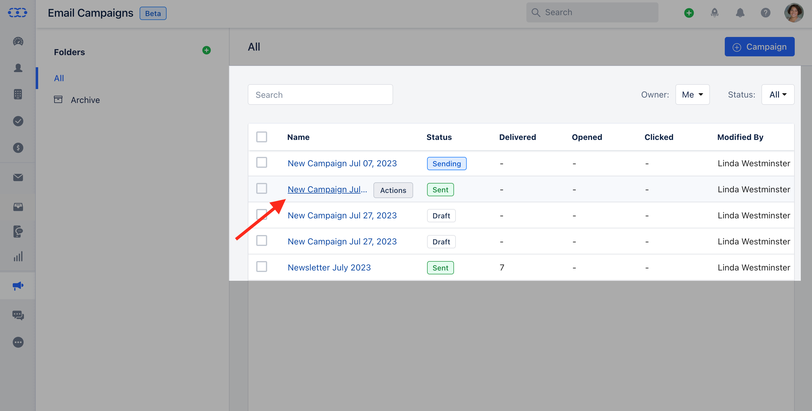

Once the Journey Email is published live, you can now view the Journey Email Insights.To view the Journey Email Insights,

Navigate to the**Outreach Icon**on the left menu barClick on**Journey Emails**.

Click on the**Journey Email**that you would like to view the**Insights**for.

When you click on the name of any campaign that is published, you will be redirected to its**detailed view**which shows the reports,**content**, and**recipient**logs that are similar to [Email Campaign.](https://support.salesmate.io/hc/en-us/sections/20016427517081-Campaign-Insights)The**report appears as a widget**and provides you with comprehensive statistics to measure the success of your campaign.**Email Performance:**By accessing this custom report, you can gain valuable insights into various email performance metrics. [Learn More](https://support.salesmate.io/hc/en-us/articles/19889963945113)**Email Overview:**It provides a high-level view of how the emails have performed and allows users to understand the effectiveness and impact of their email communications. [Learn More](https://support.salesmate.io/hc/en-us/articles/20383402708761)**Email Performance Over Time:**It will provide an overview of the email campaign's performance, including metrics such as opens and clicks. Additionally, it will highlight the specific days when the campaign received the highest number of opens and clicks. [Learn More](https://support.salesmate.io/hc/en-us/articles/20428439062937-Email-Performance-Over-Time)**Email Opened Over Time:**Provide the overview of the first 24-hour performance report of the campaign, where the user can analyze data to understand the busiest time of the day when they get the most opens. [Learn More](https://support.salesmate.io/hc/en-us/articles/20016556122137).**Top Location By Open:**Provides the report that displays the top locations with the highest number of opens for each campaign. This assists you in gaining insights into the geographical locations of your contacts when they open your campaigns. [Learn More](https://support.salesmate.io/hc/en-us/articles/20016587402777)**Top Links Clicked:**By reviewing the campaign analytics, you can easily identify the top links that received the highest number of clicks.

