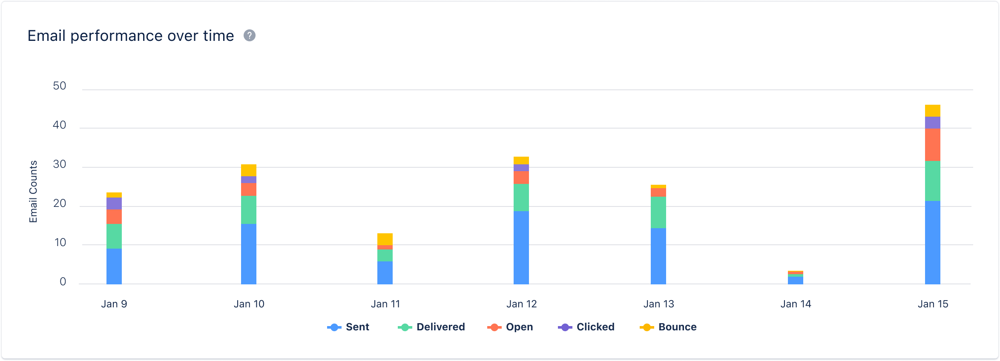

After your Email campaigns are sent, we offer a report that displays the top locations with the highest number of opens for each campaign. This assists you in gaining insights into the geographical locations of your contacts when they open your campaigns.**Topics Covered:**[Acceptance Criteria](https://support.salesmate.io/hc/en-us/articles/20016587402777-Open-Tracking-by-Top-Locations#h_01H4JQZNZY4BGV0CYQHHWJTXNV)[Report in Journey Emails](https://support.salesmate.io/hc/en-us/articles/20016587402777-Open-Tracking-by-Top-Locations#h_01H4JR077D9979SASJAQX9XT1A)

To locate Open Tracking by Top Locations report, follow these steps:

Navigate to**Outreach****Icon**on the left Menu bar.Click on**Email Campaigns.****

**Click on the**Campaign**that you like to track the Top Locations for.**

**Navigate to the**"Insights"**section.In the insights section, you will find all the reports related to the email campaign.Scroll down for the**"Open Tracking"**report, which will provide information about the top locations where the email has been opened.

### Acceptance Criteria:

The report includes the following columns that you can view:**Country**- Represents the country where the links embedded in the email were clicked.**Total Opens**- Reflects the total number of times the email was opened by recipients. Each open should be added to the total count. Additionally, display the percentage value of the total number of delivered emails.**Unique Opens**- Represents the number of recipients who opened the email campaign. This count should not consider how many times each recipient has opened the email. Include the percentage value of the total number of delivered emails.The countries displayed in the grid should be**highlighted**on the map based on the count of opens. The colour opacity of the highlighting should decrease as the number of opens decreases

### Report in Journey Emails:

By default, this report will synchronize emails from the past 30 days, and the frequency of synchronization will be set to daily.You can also export this report as a CSV file for both campaigns and journey emails. To do so, simply click on the Action option within the report widget and select "Export Data as CSV."The file will begin downloading, and its name will match the name of the report widget.

