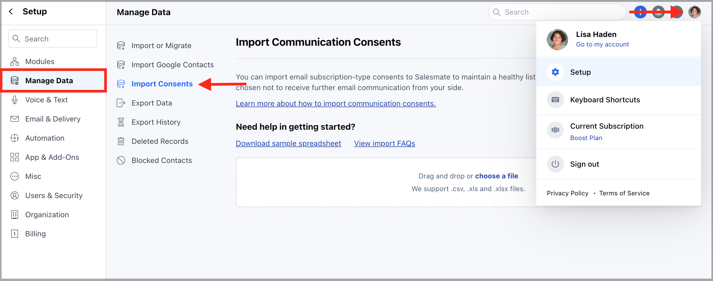
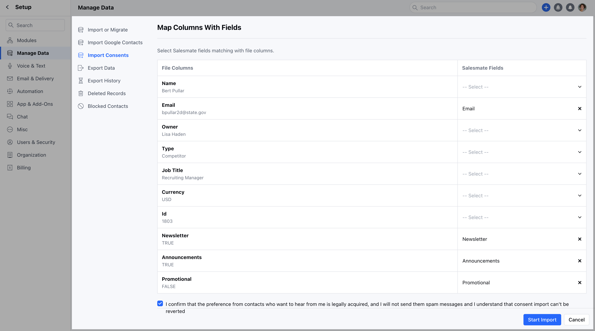
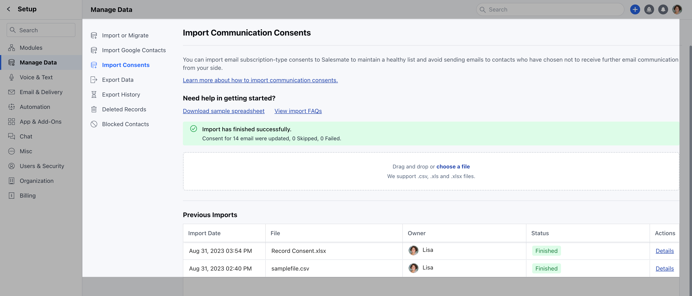
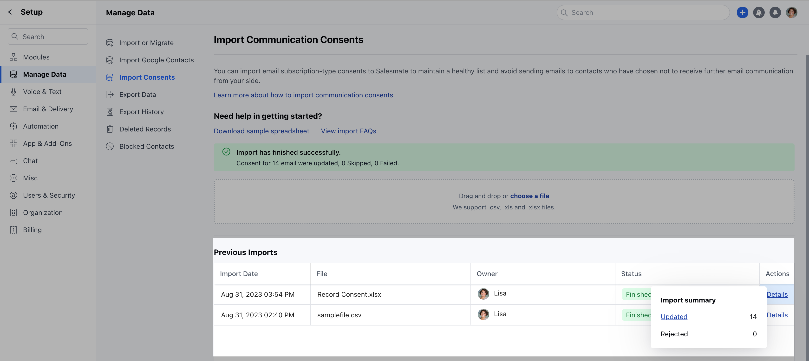
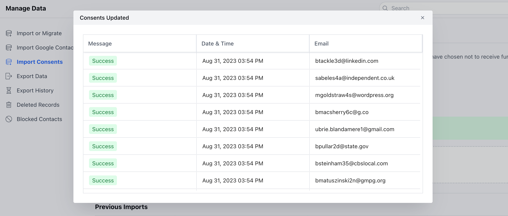

[**Consent**](https://support.salesmate.io/hc/en-us/articles/19613366377241) is a critical aspect of responsible and compliant email marketing practices. It refers to obtaining explicit permission from individuals or organizations before sending them marketing emails.Salesmate has eased the process of importing Consents with an**easy-to-click Import Feature**. It would allow you to easily import your Consent inside Salesmate if you already have them captured.

<iframe
  width="560"
  height="315"
  src="https://www.youtube.com/embed/FJSv1tpLmJY?list=PLyYol_VsdQ5kq3RxvfA2NaXeI_5bAaF1x"
  title="YouTube video"
  frameborder="0"
  allow="accelerometer; autoplay; clipboard-write; encrypted-media; gyroscope; picture-in-picture; web-share"
  allowfullscreen
></iframe>

### Note:

Please note that the User with the Admin rights can perform this action.The Automation Module should be enabled to use this Feature.

To Import Consent,

Navigate to the**Profile Icon**available on the top corner.Click on**Setup**Head over to the**Manage Data**categoryClick on**Import Consents**.

Here, you can easily Drag and Drop the file or can select the one from the system.Salesmate supports**. csv, .xls,**or**. xlxs**files.Select the file and move further to mapping the fields.In order to proceed further the User would first need to map the column that contains Email Id with Email.Map all available columns from Excel to available Email Subscription Type Consents created within the system.The system will map the fields automatically that have the same display name.The user needs to tick the checkbox for**“I confirm that the preference from contacts who want to hear from me is legally acquired, and I will not send them spam messages and I understand that consent import can’t be reverted.”**Click on**Start Import**to start importing the Consents.

### Note:

You can map one subscription type only once within a single import.At least one consent type selection is required to proceed further.

Once the Import is finished the message will appear saying**"Import has finished successfully"**along with the number of Consents Updated, Skipped, or FailedThe Consent Imported will appear under**Previous Imports**showing the following details,**Import Date:**This would show the date when the Import was performed**File:**The file that was imported**Owner:**The User who performed the Import.**Status:**The status with which the import was completed. If the Import was**Finished, In Progress, or Failed****Actions:**This will show the details of the consent imported.

As you click the Details option, it will show the**Import Summary**,**Updated:**The number of records updated**Rejected:**The number of records rejected( if the record was rejected, you will get an option to download the record and know the rejection reason)

Furthermore, if you click on**Updated**, it will view the following details.**Message****Date & Time****Email**

