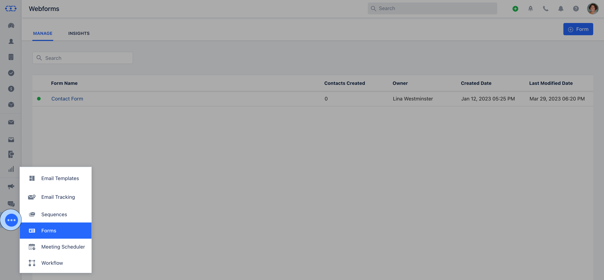
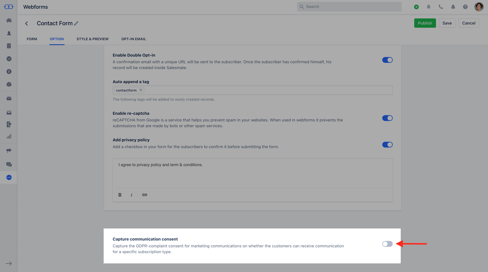
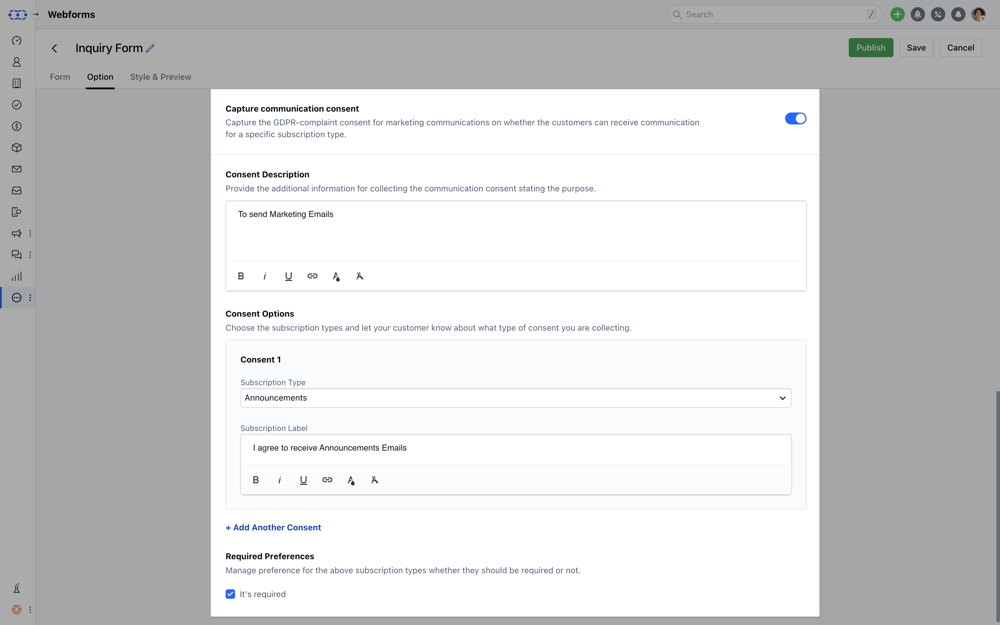
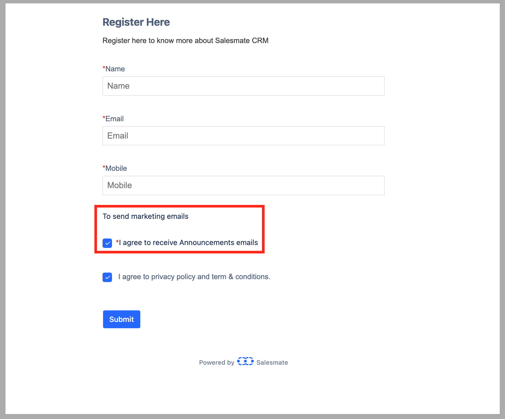
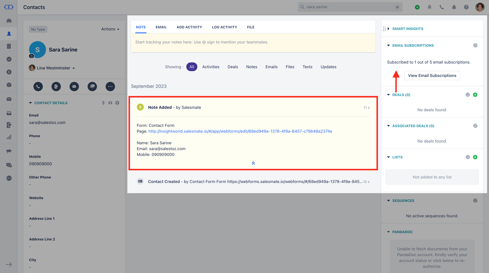

A **Webform Consent** form is a document given by a **Contact / Prospect** to an **Organization** that seeks permission to send them marketing or sales materials via Email.

<iframe width="560" height="315" src="https://www.youtube.com/embed/aeJZpLkOZ1E?list=PLyYol_VsdQ5kq3RxvfA2NaXeI_5bAaF1x" title="YouTube video" frameborder="0" allow="accelerometer; autoplay; clipboard-write; encrypted-media; gyroscope; picture-in-picture; web-share" allowfullscreen/>

### Objectives that can be achieved via Salesmate:

Salesmate offers a mechanism via Webform to capture the Consent to collect and store information about your customer's preferences when it comes to marketing.Webform Consent will help you capture your potential customer's contact details, and their preferred method of contact and inform them about your marketing terms and conditions.

### Salesmate allows you to capture Consent in two different ways:

Capture Consent via WebForms
[Import the Consent](https://support.salesmate.io/hc/en-us/articles/21957456100377-How-to-Import-Communication-Consents)

In this article, we'll learn how to Capture Communication Consent through WebForms.Topics Covered,

- [How to Enable Capture Communication Consent](#how-to-enable-capture-communication-consent)
- [How would Consent appear in Salesmate](#how-would-consent-appear-in-salesmate)

### How to Enable Capture Communication Consent

To start capturing Consent through Webform,

Navigate to the **More Icons** from the left menu barClick on **Forms**

Select the existing Form or while creating a new form, head over to the **Options** tabFind **Capture Communication Consent** at the very bottom of the page **Enable** the option in order to start capturing the consent

### As you Enable the option, it will open the following options:**Consent Description

- **Add the purpose of collecting the Consent.

- ** Consent Options for Consent 1 **Subscription Type**- Select the **Subscription Type** from the dropdown for which you would like to capture the Consent.

- **Subscription Label**- Let your customers know about which type of consent they are providing.

- **Add Another Consent -**Click on the **Add Another Consent** if you wish to capture Consent for more than one Subscription Type.

- ** Required Preferences **- Select the required preference for the selected Subscription Type, if you wish to keep this option required or not.

- **Note:**Please Note that all the above fields are required to Capture Consent.

Once you have created your form, you can **Publish** the Form.Once you **Publish** the Form, the **Consent** option will appear at the bottom of the Form.

### How would Consent appear in Salesmate

Once the **Form** is Published Live, and a Contact submits the Form a Record gets created in Salesmate.On the detail screen of the created Record, the [**View Subscriptions**](https://support.salesmate.io/hc/en-us/articles/19652302742041-View-Email-Subscriptions) widget will show the details of the number of Subscriptions Opted In by the Contact from the Total number of Subscription Types.

