Email campaigns are a powerful marketing tool that allows businesses and organizations to engage with their audience, promote products or services, and achieve marketing objectives.

### How to Create an Email Campaign

To create an Email Campaign,

Navigate to the **Outreach Icon** on the left Menu Bar.Click on** Email Campaign ***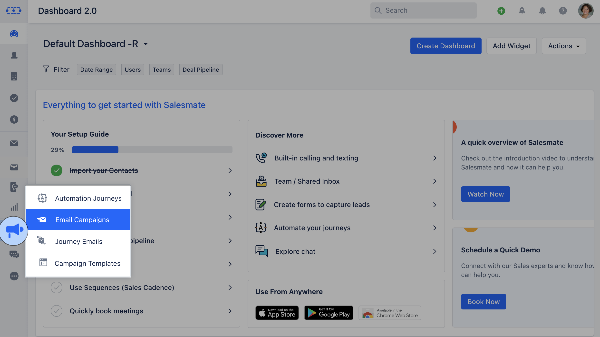

- *If you have not created any Email Campaign yet, you will be presented with the screen to create your First Email Campaign.Click on** Create First Email Campaign.

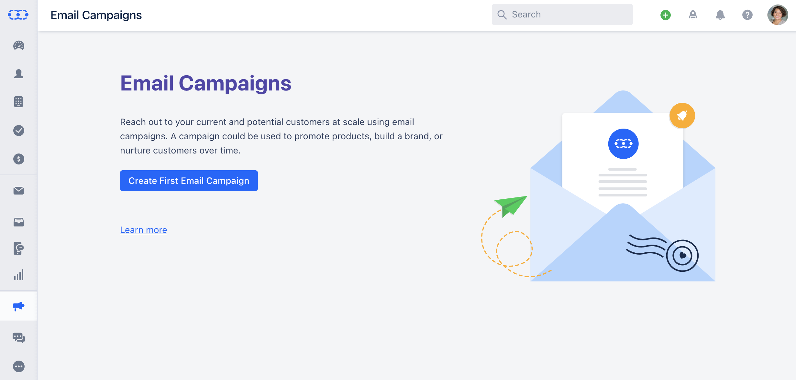

There are two steps to creating a Campaign
[**Set Up the Campaign**](#set-up-the-campaign)
[**Review & Send the Campaign**](#review-send-the-campaign)

### Set Up the Campaign

Once you click on **Create First Email Campaign** you will be redirected to the Set Up screen **Recipients**: Select the **Recipient
[List](https://support.salesmate.io/hc/en-us/articles/4402668629517)
or a
[View](#review-send-the-campaign)
**that you would like to run a Campaign for.

- **Subscription Type:** Choose the suitable [Subscription Type](https://support.salesmate.io/hc/en-us/articles/19620793155865) to run the Campaign for.

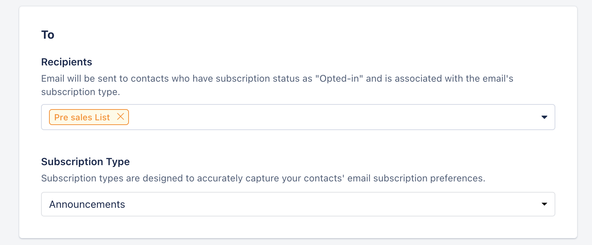

- **Subject:** The subject line of your email.

- **Preview Text:** A text summary appears within the email client below the email subject.

- **From Name:** The name of the person sending the email

- **From Email:** This is the email address that will appear inside the email header of the receiver

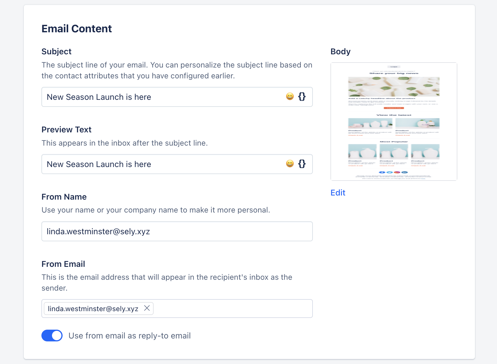

- **Enable A/B Testing:** Click to enable A/B Test and clone the variant of the current version. Make the necessary changes to either of the variants.
- [Learn More](https://support.salesmate.io/hc/en-us/articles/19889936744857)
- **Footer Details:** Choose the correct footer address information used in your email.
- [Learn More](https://support.salesmate.io/hc/en-us/articles/19889812610841)

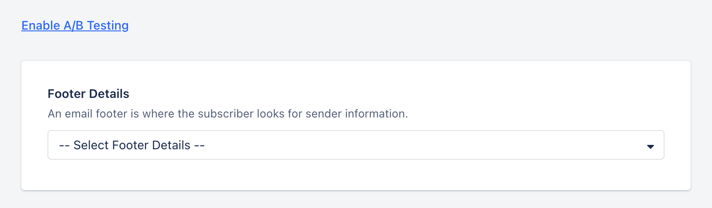

- *Tracking:**- **Reply Tracking:** Enable this option to track the data for contacts who reply to the campaign emails.

- **Email Open Tracking:** Enable this option to track the data for contacts who open the campaign emails.

- **Link Click Tracking:** Enable this option to track the unique clicks on links in the email template.

- **UTM Tracking:** Enable this option to track the traffic to your website by appending information about the campaign to each URL. You configure the custom UTM parameter and its values

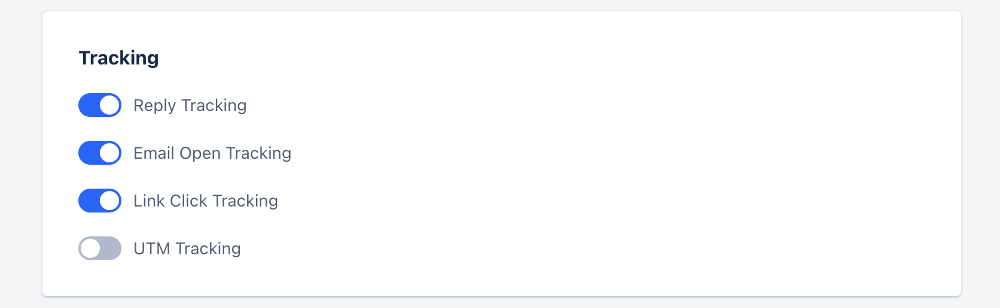

- **Delivery Options:** Send or Schedule your campaign.

- **Send now:** Select this option to start sending emails immediately.

- **Schedule for Later**: Select this option if you want to schedule the email campaign to send it later on the selected date and time.

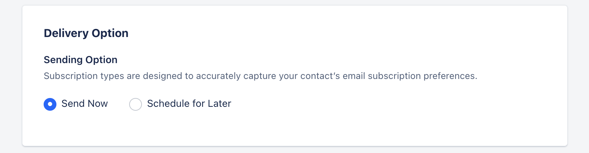

Click on **Show Additional Settings** to set the **Email Throttle Limit**.

- **Delivery Load Distribution:**Enable this option to limit the delivery rate of the email campaign. It basically controls the throttling.

- **Send a batch every**: It is the amount of time in minutes during which the system will send the campaign to a batch of contacts.

- **Max recipients per batch**: It is the maximum number of people that will be in a batch. For example, if you have 700 subscribers, a maximum of 500 will be in the first batch and the remaining will be in the second.

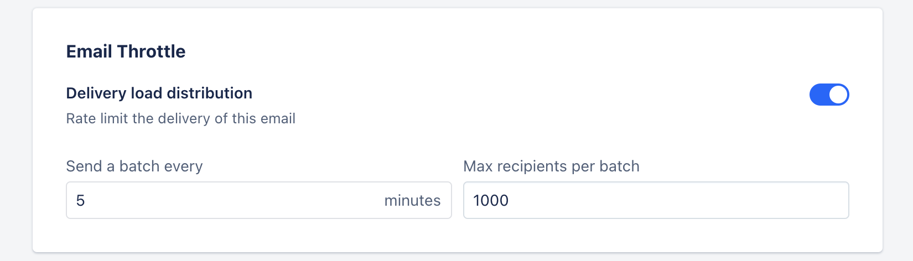

Click on **Next** and the Campaign will get Saved.

### Review & Send the Campaign

Once the click on Next the Campaign will get saved and you will be redirected to the Review Screen.

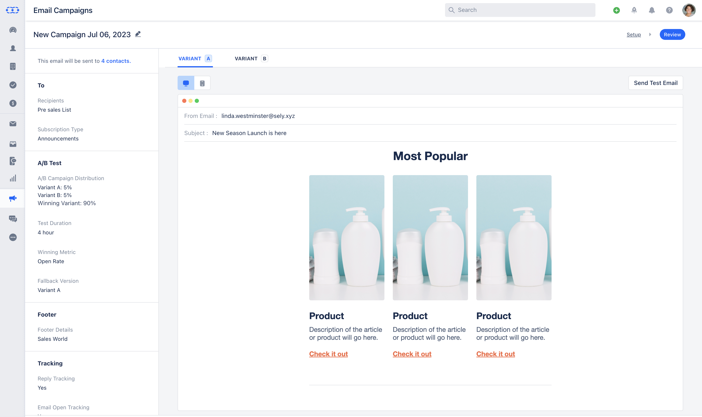

Here you will see the information that you have configured in the previous stages.You can view the details of the number of contacts that are

- **Included:** the number of contacts that have opted-in for the subscription type and will receive the email campaign.

- **Excluded:** the number of contacts that have Opted-out or consent not specified for the subscription type.

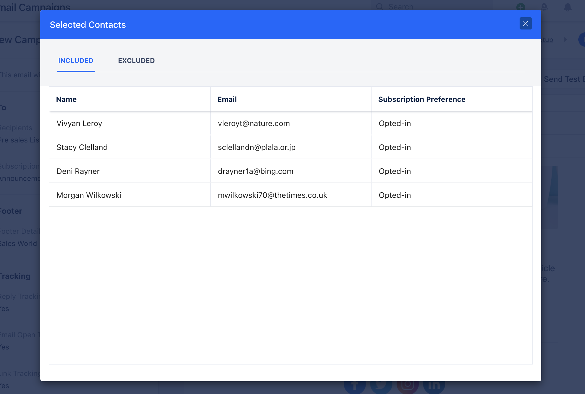

- **Links:** All the links that you have used within the Email Campaign would be displayed under** Links ***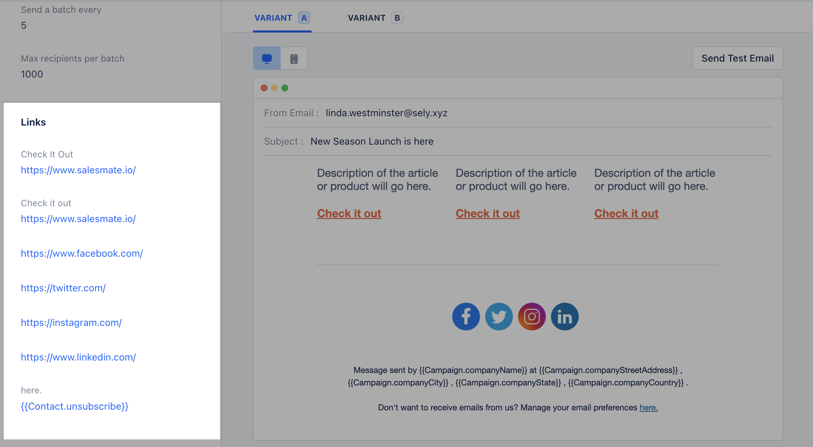

- *If you have enabled the A/B Testing you can view configured details of both the Variants.

- **Send Test Email:** You can send a test email to any email address for understanding the end delivery.

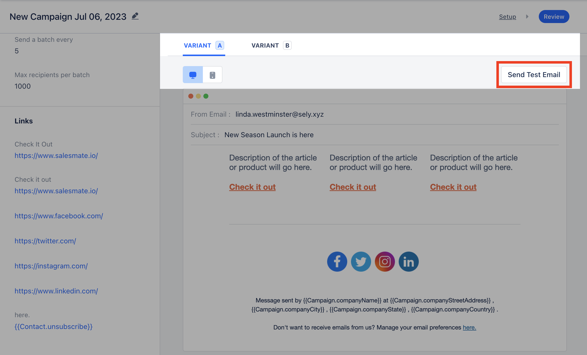

Click on the Pencil Icon located in the top left corner to Edit the **Campaign Name** and move it to the appropriate **Folder.

- ** Click on **Save**.

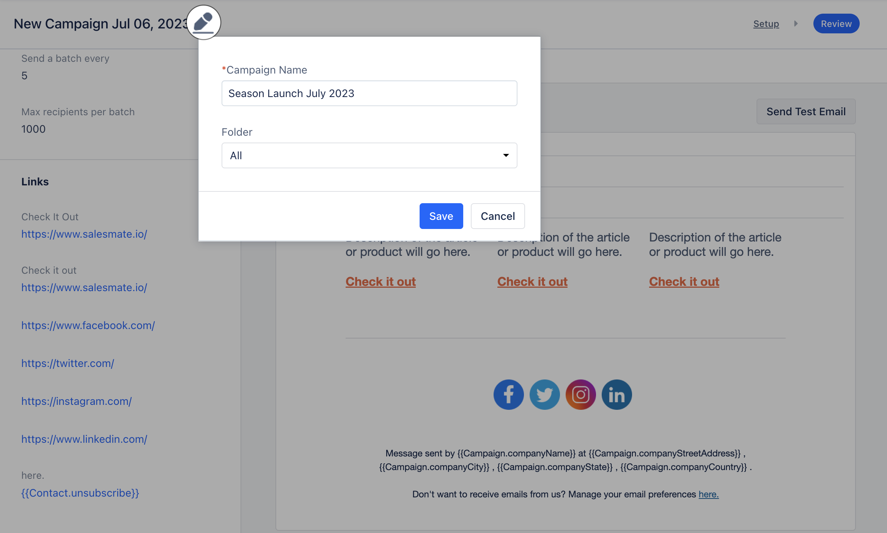

If the configuration looks good, you can click on **Send** to send out the **Email Campaign**. If you chose **Schedule Late** r then you can schedule it to send at your preferred time.
